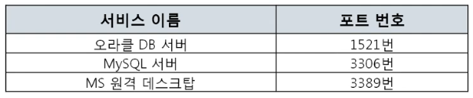

#### [전체 목차로 돌아가기](../../README.md)
## 1. 4계층 프로토콜
1. 4계층에서 하는 일
    - 송신자의 **프로세스**와 수신자의 **프로세스**를 **연결하는 통신서비스**를 제공  
2. 4계층 프로토콜의 종류
    - UDP : 비연결 지향 프로토콜
    - TCP : 연결 지향 프로토콜

## 2. 연결 지향 vs. 비연결 지향
- 연결 지향 프로토콜은 비용이 비싸다.
- 비연결은 매번 새롭게 연결이 성립되기 때문에 필요한 경우 매 연결시 자신이 누군지 알려야 함
    - HTTP를 이용한 웹의 경우 쿠키나 세션을 통해 매번 자신을 식별할 수 있는 정보를 함께 전송한다.  
- 연결 지향 : 전화, TCP
- 비연결 지향 : IP, HTTP, UDP

## 3. 포트 번호
1. 포트번호의 특징
    - 하나의 포트는 하나의 프로세스만 사용 가능하다.
    - 일반적으로 정해져있지만, 무조건 지켜야 하는 것은 아니다.  
2. Well-Known 포트 
    <figure>
    
    </figure>
3. Registered 포트 
    <figure>
    
    </figure>
4. Dynamic 포트 
    <figure>
    
    </figure>

## 4. 명령어 : 프로그램의 연결 정보
1. 나와 현재 연결되어 있는 컴퓨터들
    - netstat -ano 
        <figure>
        
        </figure>
