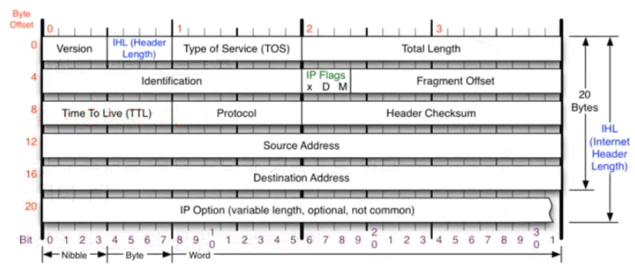

#### [전체 목차로 돌아가기](../../README.md)
## 1. IPv4 프로토콜
1. IPv4가 하는 일
    - 네트워크 상에서 데이터를 교환하기 위한 프로토콜
    - 데이터가 **정확하게 전달될 것을 보장하지 않는다.**
2. IPv4 프로토콜의 구조 
        <figure>
        
        </figure>
    - Version (0.5): 4버젼이므로 (04)가 온다.
    - IHL (0.5): IP 헤더의 길이/4 (5~15)
    - TOS (1): 지금은 쓰이지 않아 (0) 으로 비워둔다
    - Total Length (2): 페이로드를 포함한 전체 길이
    - Identification (2): 원래 하나였던 데이터 패킷에 부여하는 식별자로, 다시 합칠 때 사용
    - **IP Flags (3/8)**: x D M 의 3비트로 이루어져있으며, x는 사용하지 않는 자리이다.
        - D (Dont Fragmentation): 쪼개지 않겠다는 의미. 그러나 최소 전송단위를 넘으면 전송이 되지 않는다.
        - M (More Fragmentation): 조각이 더 있다는 의미. 마지막 데이터를 제외하면 모두 1을 가진다.
    - Fragment Offset (5/8): 데이터 조각이 시작부분으로부터 얼마나 떨어져 있는지 표시.
    - TTL (1): 패킷이 살아남을 수 있는 홉의 수. 운영체제마다 다르다. 윈도우 (128), 리눅스 (64)
    - Protocol (1): 상위 프로토콜에 대한 정보. ICMP (01), TCP (06), UDP (17)
    - Header Checksum (2): 헤더의 오류를 검사하는 코드. 계산해 볼 필요 X
    - Source/Destination Address (4, 4): 출발지와 목적지의 IP 주소.
    - IP Option (4~40): 추가 옵션을 작성하는 부분. 잘 안씀.
