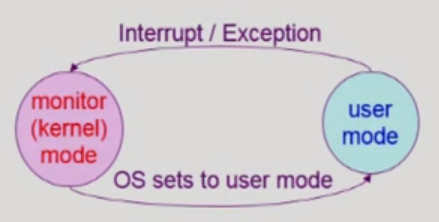
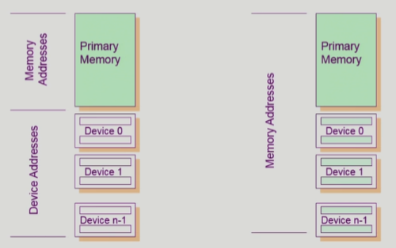
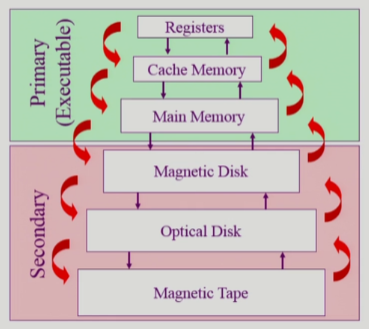
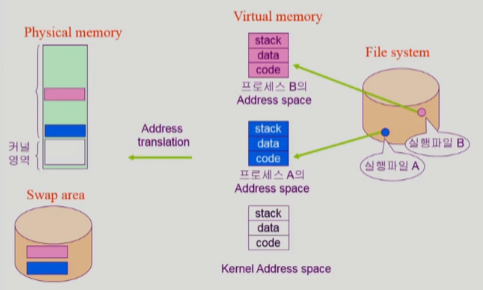

#### [전체 목차로 돌아가기](../README.md)
## 목차
- [1. 컴퓨터 시스템 구조](#1-컴퓨터-시스템-구조)
  - [1-1. 컴퓨터 시스템 구조 개략도](#1-1-컴퓨터-시스템-구조-개략도)
  - [1-2. 모드비트](#1-2-모드비트)
  - [1-3. 인터럽트](#1-3-인터럽트)
  - [1-4. 동기식/비동기식 입출력](#1-4-동기식비동기식-입출력)
  - [1-5. DMA Controller](#1-5-dma-controller)
  - [1-6. 서로 다른 입출력 기계어](#1-6-서로-다른-입출력-기계어)
  - [1-7. 저장장치 계층 구조](#1-7-저장장치-계층-구조)
- [2. 프로그램의 실행](#2-프로그램의-실행)
  - [2-1. 프로그램 실행(메모리 로드) 개략도](#2-1-프로그램-실행메모리-로드-개략도)
  - [2-2. 커널 주소 공간](#2-2-커널-주소-공간)
  - [2-3. 사용자 프로그램이 사용하는 함수](#2-3-사용자-프로그램이-사용하는-함수)
  - [2-4. 프로그램의 실행](#2-4-프로그램의-실행)

# 1. [컴퓨터 시스템 구조](#목차)
## 1-1. [컴퓨터 시스템 구조 개략도](#목차)
- 개략도
        <figure>
        
        </figure>
- 앞으로 공부할 것들:
    1. CPU가 일할 방식에 대한 내용: Interupt line, Mode bit, Register, Program Counter
    2. 인터럽트와 관련있는 것들 : DMA controller, Timer, System call
    3. 메모리 로딩에 관련된 것들 : file system, swap area, Virtual memory
    4. 기타 등등

## 1-2. [모드비트](#목차)
- 사용자가 프로그램의 잘못된 수행으로 다른 프로그램 및 운영체제에 피해가 가지 않도록 하기 위한 보호장치
- 두 가지 모드의 Operation
    1. 사용자 모드 (1) : 사용자 프로그램 수행
    2. 모니터 모드 (0) : OS 코드 수행
       - 보안을 해칠 수 있는 중요한 명령어를 수행하는 모드
- 인터럽트, 예외상황 발생 시 하드웨어가 mode bit을 0으로 바꾸며 커널모드로 전환
- 커널모드에서 사용자 프로그램에게 CPU를 넘기기 전에 mode bit을 1로 세팅 
    <figure>
    
    </figure>

## 1-3. [인터럽트](#목차)
- 인터럽트란, 프로그램 내/외부적으로 시스템을 호출하도록 하는 장치이다.
    - 인터럽트가 발생할 경우, 레지스터와 프로그램 카운터를 저장한 후 CPU의 제어를 인터럽트 처리 루틴으로 넘기게 된다.
- 인터럽트 분류
    1. 하드웨어 인터럽트(일반적인 인터럽트)
        - 하드웨어인 Timer, Device controller, DMA controller 등이 발생시킨다. 
            <figure>
            
            </figure>
    2. 소프트웨어 인터럽트(트랩)
        - Exception : 프로그램이 오류를 범한 경우 (ex. 0으로 나누기)
        - System Call : 프로그램이 운영체제의 서비스를 받기 위해 커널 함수를 호출하는 경우 
            <figure>
            
            </figure>
    - 프로그램이 CPU를 내려놓는 경우
      1. I/O가 필요할 때
      2. Timer에 걸렸을 때  
- I/O 인터럽트의 과정
    1. 프로그램A의 시스템 콜로 인터럽트를 걸며 OS 호출
    2. OS가 Device Controller에게 명령을 내린 후, 프로그램B에 CPU 할당
    3. 프로그램B가 CPU를 사용하는 도중 Device controller가 I/O 완료 인터럽트로 OS 호출
    4. OS가 프로그램A에 I/O값을 입력하며 다시 프로그램A에게 CPU할당
       - 두번의 인터럽트가 발생한다.  
- 용어
    - 인터럽트 백터 : 해당 인터럽트의 처리 루틴 주소를 가리킴
    - 인터럽트 처리 루틴 (=인터럽트 핸들러) : 해당 인터럽트를 처리하는 커널 함수  
- 참고사항
    - Device controller : I/O 장치 내의 펌웨어에 의해 디바이스를 컨트롤함
    - Device driver : 운영체제 내부에 device controller를 조작하도록 cpu가 실행하는 코드

## 1-4. [동기식/비동기식 입출력](#목차)
- 동기식/비동기식 입출력 개략도 
    <figure>
    
    </figure>
1. 동기식 입출력
    - I/O 요청 후 입출력 작업이 완료된 후에야 제어가 사용자 프로그램에 넘어간다.
    - 구현 방법
        1. I/O가 끝날 때 까지 CPU를 대기시키는 방법
            - 매 시점 하나의 I/O만 가능하기 때문에 I/O 장치와 CPU 모두 낭비된다.
        2. I/O가 완료될 때 까지 프로그램에게서 CPU를 빼앗음
            - 일반적으로 사용하는 방법
            - Read 등 입출력 결과에 따라 소프트웨어의 다음 작업이 달라지는 경우 사용
2. 비동기식 입출력
    - I/O 요청 후 작업 결과와 상관없이 해당 프로그램의 다음 작업을 실시한다.
        - Write 등 결과와 상관없이 다음 작업이 가능한 경우 사용

## 1-5. [DMA Controller](#목차)
- DMA(Direct Memory Access) : 빠른 입출력 장치를 메모리에 가까운 속도로 처리하기 위해 사용한다.
    - 인터럽트 자체도 오버헤드이기 때문에, 고속 I/O 장치에 의해 인터럽트가 과부하될 경우 성능저하가 일어난다. 
    - 따라서, DMA controller를 이용하여 I/O 작업을 바이트 단위가 아닌 블록 단위로 인터럽트를 걸어 준다. 
        <figure>
        
        </figure>
    - DMA는 I/O를 블록단위로 메모리에 복사하는 작업까지 직접 수행한다(왼쪽 그림).

## 1-6. [서로 다른 입출력 기계어](#목차)
1. Special instruction for I/O
    - 메모리 주소와 I/O를 전담하는 기계어를 따로 두고 관리한다.
2. Memory Mapped I/O
    - 메인 메모리 주소를 연장하여 I/O 주소를 할당한다. 
    <figure>
    
    </figure>

## 1-7. [저장장치 계층 구조](#목차)
1. Primary(Executable)
    - CPU가 직접 실행 가능한 메모리
    - 상위 계층일 수록 가격, 속도가 증가한다.
    - 휘발성 데이터
2. Secondary
    - HDD, SSD 등 비휘발성 저장 장치
    - 메모리에 올려놓기 전 상태, CPU가 직접 접근하지 않음 
    <figure>
    
    </figure>
- 참고(캐싱)
    - 장치간 속도 차이를 극복하기 위해 당장 필요한 것만 가져다 쓰는 것
    - 목적은 재사용
    - 관리 방법도 중요 (나중에 배움)

# 2. [프로그램의 실행](#목차)
## 2-1. [프로그램 실행(메모리 로드) 개략도](#목차)
- 개략도
    <figure>
    
    </figure>
1. 파일 시스템 : 프로세스에 대한 정보가 담겨있는 파일들이 저장되어 있음
2. 가상 메모리 : 각 프로세스(커널 포함)들의 독자적인 주소공간
    1. Stack : 함수를 호출하고 리턴하는 영역, 지역 변수 등의 데이터를 쌓고 꺼내는 영역
    2. Code : CPU에서 실행될 기계어 코드가 저장되어 있는 영역
    3. Data : 전역 변수나 사용할 자료구조 등이 저장되어 있는 영역
3. 메모리 : 현재 사용중인 프로세스가 올라가는 저장 공간
4. 스왑 영역 : 메모리가 가득 찼을 경우, 우선순위가 낮은 프로세스를 스왑영역에 보관
    - 스왑 영역은 디스크의 일부이지만, 전원이 꺼질 경우 가상메모리 주소 정보가 사라지므로 의미없는 데이터가 된다.
    - 반면 파일 시스템의 경우, 가상 메모리 주소와 상관없이 디스크에 저장된 정보이므로 전원이 꺼져도 그 자체로 의미를 가진다.

## 2-2. [커널 주소 공간](#목차)
1. Code
    - 시스템콜, 인터럽트를 처리하기 위한 코드
    - 자원 관리를 위한 코드
    - 편리한 서비스 제공을 위한 코드
2. Data
    - CPU, 메모리, Disk에 대한 변수나 자료구조
    - 각 프로세스의 PCB(Process control block)
3. Stack
    - 각 프로세스의 커널 스택
    - 프로세스마다 스택을 따로 가진다.

## 2-3. [사용자 프로그램이 사용하는 함수](#목차)
1. 사용자 프로세스의 주소공간에 있는 함수
    1. 사용자 정의 함수
        - 자신의 프로그램에서 정의한 함수
    2. 라이브러리 함수
        - 다른 사람이 정의한 함수를 가져다 쓴 경우
        - 사용자 프로세스의 주소공간에 포함되어 있다.  
2. 커널의 주소공간에 있는 함수
    1. 커널 함수
        - 운영체제의 커널 주소공간에 있는 함수
        - 사용자 프로세스에서 시스템콜을 이용하여 호출 가능

## 2-4. [프로그램의 실행](#목차)
- 프로세스 관점에서의 프로그램 시작부터 종료 
        <figure>
        
        </figure>
    - 커널 함수를 사용하기 위해 시스템콜을 하고, CPU를 OS에 넘겨준 뒤 다시 돌려받음
    - 라이브러리 함수, 사용자 정의 함수를 사용할 땐 OS 호출 없음