#### [전체 목차로 돌아가기](../README.md)
## 목차

- [1. CPU Scheduling Intro](#1-cpu-scheduling-intro)
- [2. CPU Scheduling Algorithm](#2-cpu-scheduling-algorithm)
  - [2-1. FCFS](#2-1-fcfs)
  - [2-2. SJF](#2-2-sjf)
  - [2-3. Priority](#2-3-priority)
  - [2-4. RR](#2-4-rr)
  - [2-5. Multilevel Queue](#2-5-multilevel-queue)
  - [2-6. Multilevel Feedback Queue](#2-6-multilevel-feedback-queue)
- [3. Multiprocessor Scheduling](#3-multiprocessor-scheduling)
- [4. Real-time Scheduling](#4-real-time-scheduling)
- [5. Algorithm Evaluation](#5-algorithm-evaluation)

# 1. [CPU Scheduling Intro](#목차)
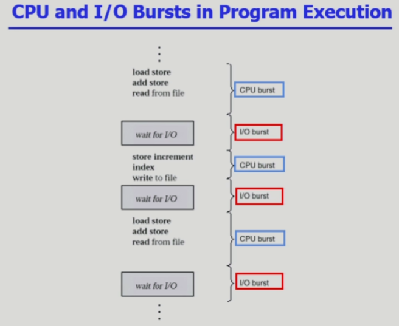 
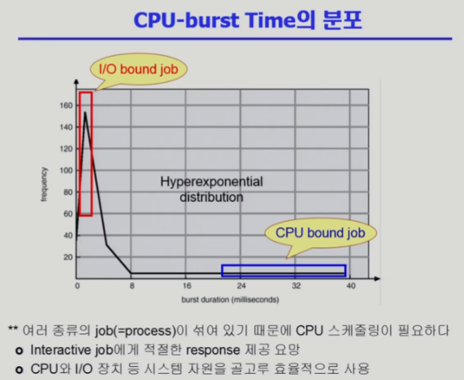 
 
 

# 2. [CPU Scheduling Algorithm](#목차)
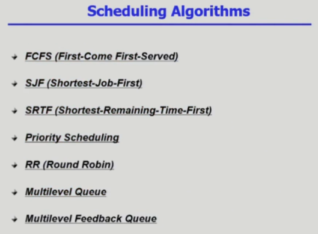 

## 2-1. [FCFS](#목차)
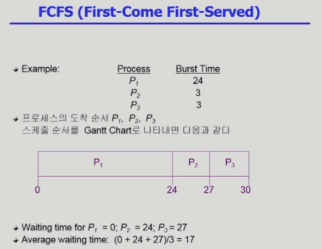 
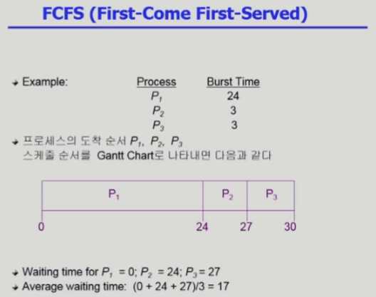 

## 2-2. [SJF](#목차)
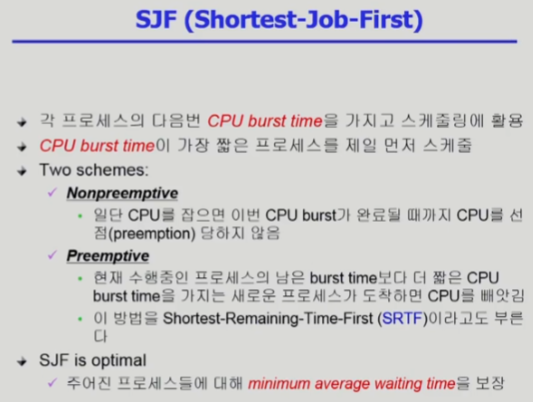 
 
 
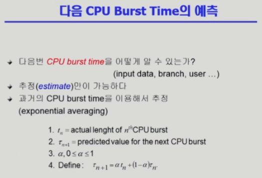 
 

## 2-3. [Priority](#목차)
 

## 2-4. [RR](#목차)
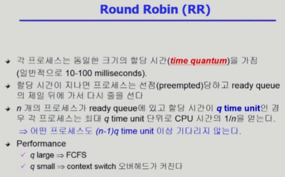 
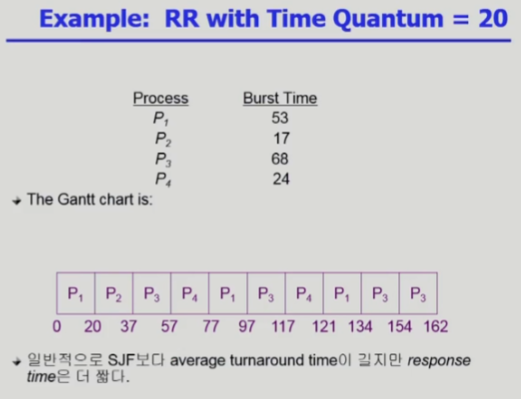 
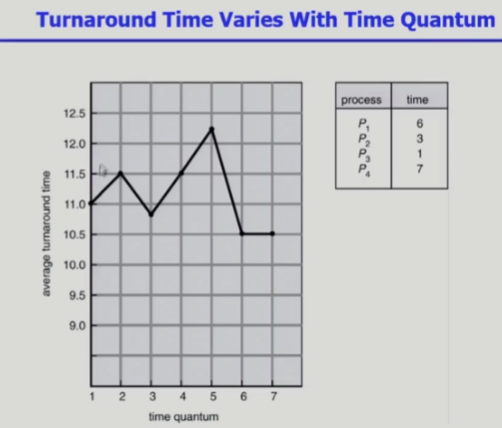 

## 2-5. [Multilevel Queue](#목차)
 
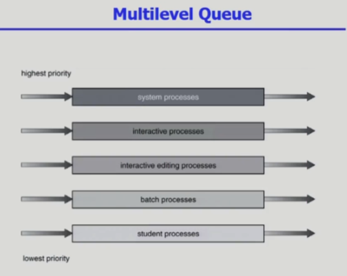 

## 2-6. [Multilevel Feedback Queue](#목차)
 
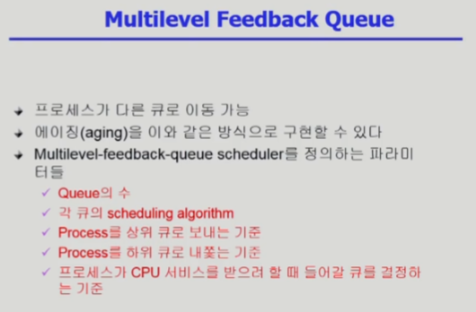 
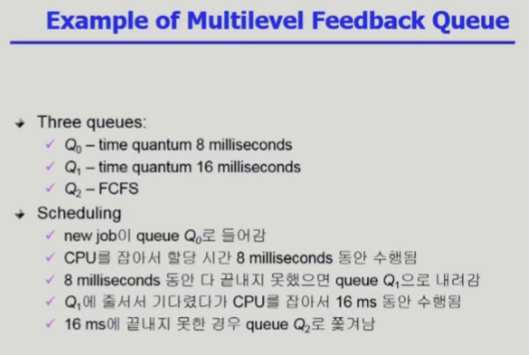 

# 3. [Multiprocessor Scheduling](#목차)
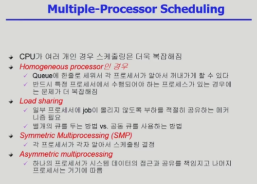 

# 4. [Real-time Scheduling](#목차)
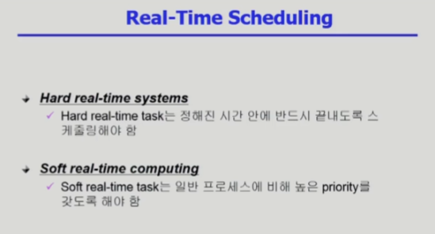 
 

# 5. [Algorithm Evaluation](#목차)
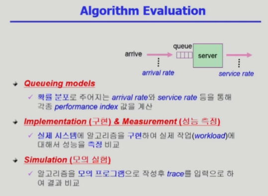 
