#### [전체 목차로 돌아가기](../README.md)
## 목차


# 1. Race Condition
## 1-1. 데이터의 접근
- 컴퓨터의 연산 순서<br>
        <figure>
        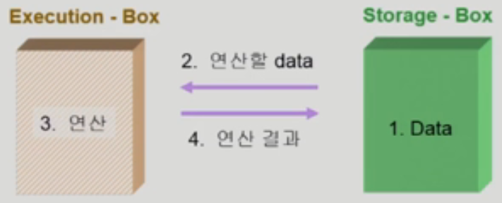
        </figure>
    1. 저장 공간에서 데이터를 읽는다.
    2. 연산장치에서 연산을 한다.
    3. 다시 저장장치에 연산 결과를 저장한다.
    - ex: CPU-Memory, PC-Disk, Process-Adress Space

## 1-2. Race Condition
- 저장공간을 공유하는 연산장치가 여럿 있을 경우, Race Condition의 가능성이 있다.<br>
    <figure>
    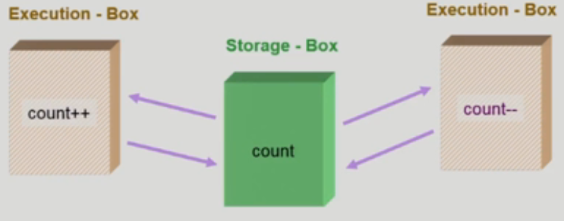
    </figure>
- Race Condition : 둘 이상의 입력이 타이밍에 따라 결과값에 영향을 줄 수 있는 상태.
    - Multiprocessor system
    - 공유 메모리를 사용하는 프로세스
    - 커널 내부 데이터를 접근하는 루틴들

## 1-3. Race condition이 일어나는 경우
### 1-3-1. Race Condition in OS
<hr>

### 1. 커널 수행 중 인터럽트가 발생하는 경우
- 커널 수행 중 **우선순위가 높은 인터럽트**가 발생하여 처리루틴을 수행하게 되면, 두 연산이 모두 **커널 주소 공간을 공유**하므로 문제가 발생할 수 있다.
- 해결책 : 메모리 변경 함수를 이용하는 도중에는 인터럽트에 의해 커널을 뺐기지 않도록 설정<br>
    <figure>
    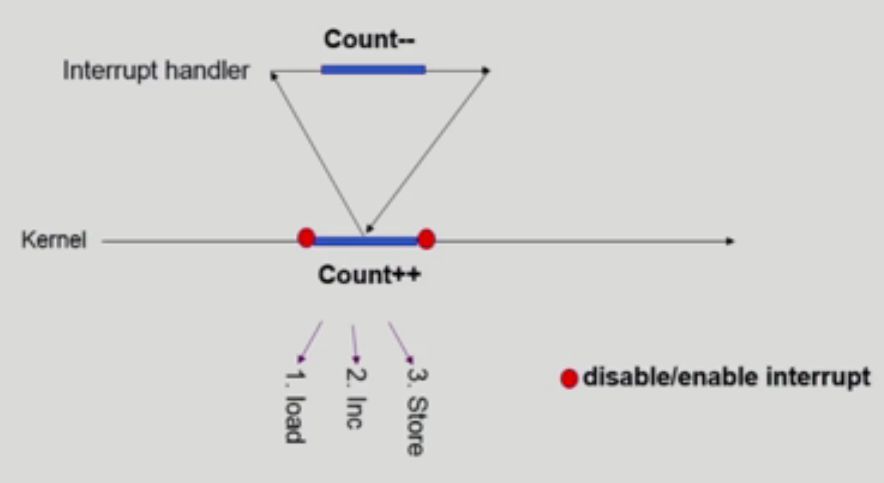
    </figure>

### 2. 프로세스가 시스템콜을 하여 커널모드 수행중에 문맥교환이 일어나는 경우
- 한 프로세스가 **커널 수행 중** 다른 프로세스가 **CPU를 선점**해가는 경우, 시스템콜 중에는 **커널 주소 공간의 데이터는 공유**하게 되기 때문에 문제가 발생할 수 있다.
- 해결책 : 커널모드 수행 중에는 CPU를 선점하지 않도록 설정<br>
    <figure>
    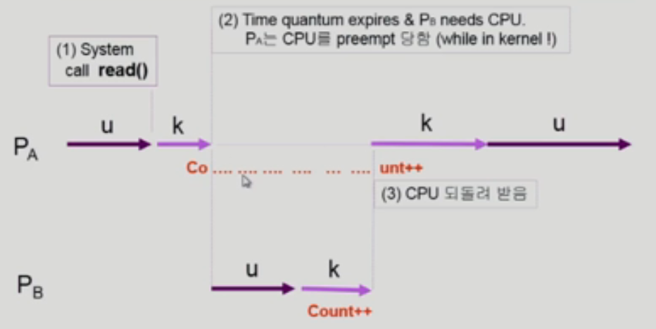
    </figure>

### 3. 멀티 프로세서 시스템에서 공유메모리 내의 커널 데이터를 건드리는 경우
- **여러 CPU가 하나의 메모리를 공유**하는 경우, 여러 CPU가 **동시에 커널에 접근할 수 있으므로** 문제가 발생할 수 있다.
- 해결책
    - 방법 1: 한번에 하나의 CPU만 커널에 들어갈 수 있게 하는 방법 (비효율적)
    - 방법 2: 커널 내부에 있는 각 공유데이터에 접근할 때 lock/unlock을 하도록 하는 방법<br>
    <figure>
    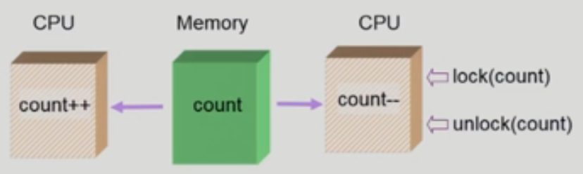
    </figure>

### 1-3-2. Race Condition in Process
<hr>

- 공유 데이터의 동시접근으로 생길 수 있는 데이터의 불일치 문제<br>
        <figure>
        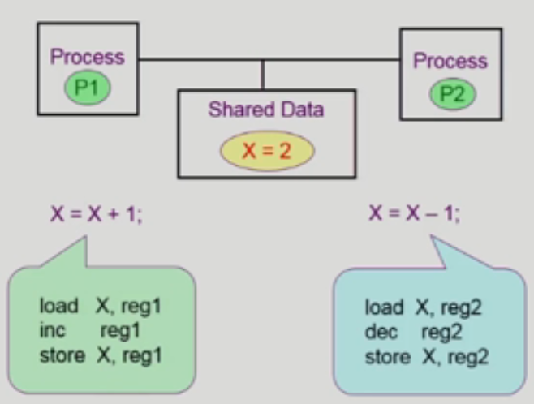
        </figure>
- 해결책 : 일관성 유지를 위해서 협력 프로세스 사이에 실행 순서를 정해주는 메커니즘(Concurrent process의 동기화)이 필요하다.

# 2. Critical-Section
- Critical Section : 각 프로세스의 코드 구획에는 공유 데이터를 접근하는 코드

## 2-1. The Critical-Section Problem
- 여러개의 프로세스가 공유 데이터를 동시에 사용하기를 원하는 경우<br>
        <fugure>
        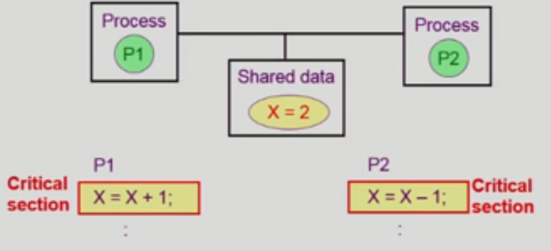
        </fugure>
- Race Condition을 해결하기 위해서 하나의 프로세스가 critical section에 있을 때 다른 모든 프로세스는 critical section에 들어갈 수 없어야 한다.

## 2-2. 프로그램적 해결법의 충족 조건
### 1. Mutual Exclusion
- 한 프로세스가 critical section 부분을 수행 중이면 다른 모든 프로세스들은 그들의 critical section에 들어가면 안된다.

### 2. Progress
- 아무도 critical section에 있지 않은 상태에서 critical section에 들어가고자 하는 프로세스가 있으면 critical section에 들어가게 해주어야 한다.

### 3. Bounded Waiting
- 프로세스가 critical section에 들어가려고 요청한 후부터 그 요청이 허용될 때까지 다른 포러세스들이 critical section에 들어가는 횟수에 한계가 있어야 한다.

#### 가정
- 모든 프로세스의 수행 속도는 0보다 크다
- 프로세스들 간의 상대적인 수행 속도는 가정하지 않는다.

## 2-3. Initial Attemps to Solve Problem
- 프로세스들의 일반적인 구조<br>
    <figure>
    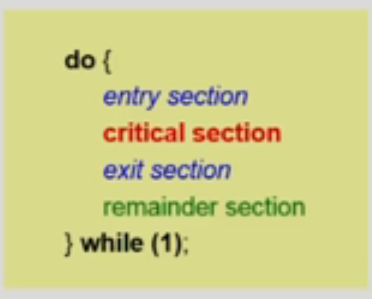
    </figure>
- Synchronization variable : 프로세스들은 수행의 동기화를 위해 몇몇 변수를 공유할 수 있다.

### 알고리즘 1
- Synchronization variable
    ```C
    int turn;
    initally turn = 0;  // Pi는 turn이 i일 경우 critical section에 들어갈 수 있다.
    ```
    <br>
    <figire>
    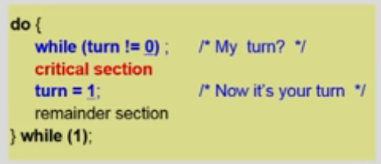
    </figire>
- 반드시 한번씩 교대로 들어가야하기 때문에(swap-turn), 상호 배제는 만족하지만 progress를 만족하지 않는다.
- 과잉양보 : 상대가 turn을 바꿔줘야만 내가 들어갈 수 있다.
- 특정 프로세스가 더 빈번히 critical section을 들어가는 경우 비효율적

### 알고리즘 2
- Synchronization variables
    ```C
    boolean flag[2];
    initially flag[모두] = false;   /*no one is in CS*/

    // flag[i] 가 True일 경우, Pi가 critical section에 들어갈 수 있다.
    ```
<br>
    <figure>
    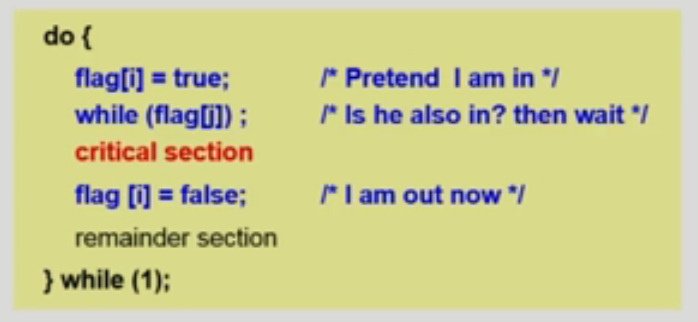
    </figure>

- 의사표현을 기반으로 하기 때문에 상호 배제는 만족하지만, progress를 만족하지 않는다.
- 오류 : 둘 다 2행까지 수행 후 끊임 없이 양보하는 상황 발생 가능

### 알고리즘3(Peterson's Algorithm)
- Combined synchronization variables of algorithms 1 and 2.<br>
    <fugure>
    
    </fugure>
- 의사표현을 한 프로세스에 한해 교대로 사용하는 방법, 세 가지 조건을 모두 만족한다.
- Busy Waiting(=spin lock) : 계속 CPU와 memory를 쓰면서 wait (비효율적)

# 3. Semaphores
## 3-1. Synchronization Hardware
- 하드웨어적으로 Test & modify를 atomic하게 수행할 수 있도록 지원하는 경우 해결 가능하다.<br>
    <figure>
    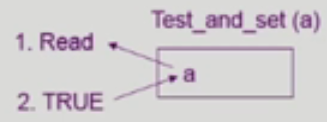
    </figure>
- Test & Set 으로 상호 배제<br>
    <figure>
    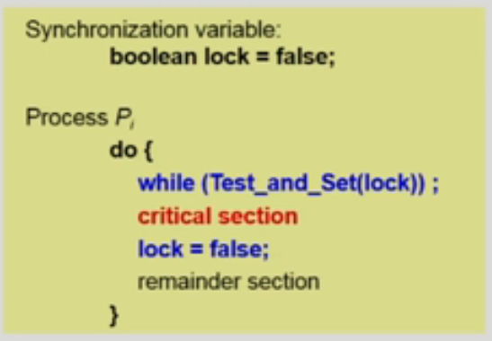
    </figure>

## 3-2. Semaphores
- 앞의 방식들을 추상화 시킨 것
- 추상 자료형 : 구현에 대한 논의보단, Object와 Operation(정의)로 구성되는 자료형
- Semaphore S
    - integer variable
    - 아래 두 가지 atomic 연산에 의해서만 접근 가능<br>
        <figure>
        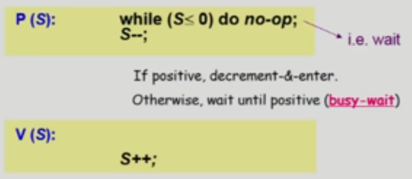
        </figure>

## 3-3. Block / Wakeup Implementation
### Critical Section of n Processes
<figure>
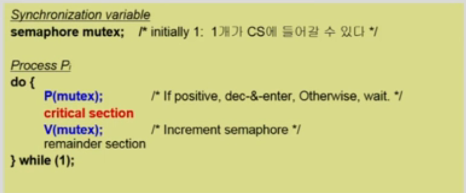
</figure>

- Busy-wait는 비효율적이므로, Block & Wakeup 방식으로 구현한다.

### Block / Wakeup Implementation
- Semaphore<br>
    <figure>
    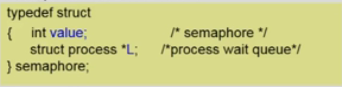
    </figure>
- 가정
    - block : 커널은 block을 호출한 프로세스를 suspend 시키고, 이 프로세스의 PCB를 semaphore에 대한 wait queue에 넣는다.
    - wakeup(P) : block된 프로세스를 wakeup시키고, 이 프로세스의 PCB를 ready queue로 옮긴다.<br>
        <figure>
        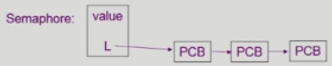
        </figure>

### Implementation
- block/wakeup version of P() & V()<br>
    <figure>
    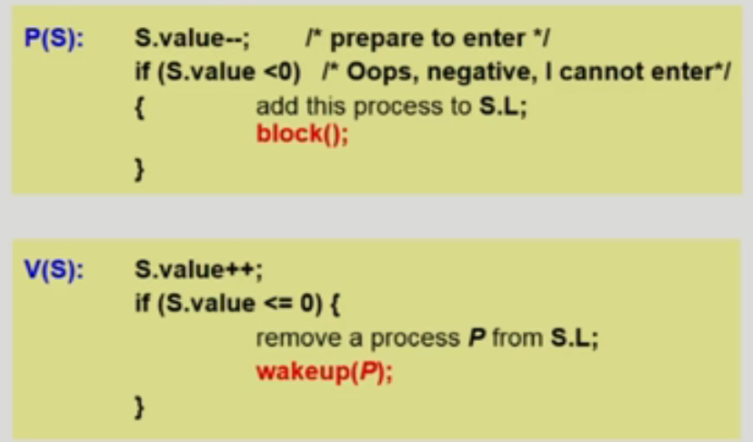
    </figure>
- 대기할 때 세마포어를 음수로 감소시키며 Block 되고, 연산을 마칠 때 세마포어가 음수라면 대기열 중 하나를 깨움

## 3-4. 비교
### Busy-wait vs. Block/wakeup
- Block/wakeup overhead vs. Critical section 길이
    - Critical section의 길이가 긴 경우(경쟁이 심한 경우) Block/Wakeup이 적당하다.
    - Critical section의 길이가 짧은 경우(경쟁이 적은 경우) Block/Wakeup의 오버헤드가 커질 수 있다.
    - 일반적으로는 Block/Wakeup이 적당한 경우가 많다.

## 3-5. Semaphores Types
- Counting semaphore
    - 도메인이 0 이상인 임의의 정수값
    - 주로 resource counting에 사용
- Binary semaphore(=mutex)
    - 0 또는 1의 값만 가질 수 있는 semaphore
    - 주로 상호 배제(lock/unlock)에 사용

# 4. Problems
## 4-1. Deadlock and Starvation
- Deadlock : 둘 이상의 프로세스가 서로 상대방에 의해 충족될 수 있는 event를 무한히 기다리는 현상
    - S와 Q가 1로 초기화된 Semaphore에서,<br>
        <figure>
        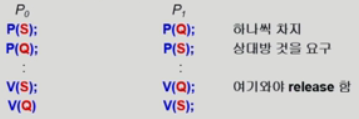
        </figure>
- Starvation(=Indefinite blocking) : 프로세스가 suspend된 이유에 해당하는 세마포어 큐에서 빠져나갈 수 없는 현상
- 해결 방법 : 자원을 얻는 순서를 미리 정의해주도록 함

## 4-2. Classical Problems of Synchronization
### 4-2-1. Bounded-Buffer Problem(Producer-Consumer Problem)
<figure>
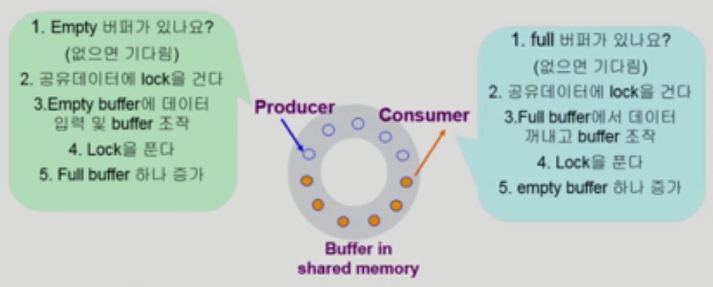
</figure>

- Shared Data
    - buffer 자체 및 buffer 조작 변수(empty/full buffer의 시작 위치)
- Synchronization variables
    - 상호 배제 : 공유 데이터의 상호 배제를 위해 binary semaphore 필요
    - resource count : 남은 full/empty buffer의 수를 표시하기 위해 integer semaphore 필요<br>
        <figure>
        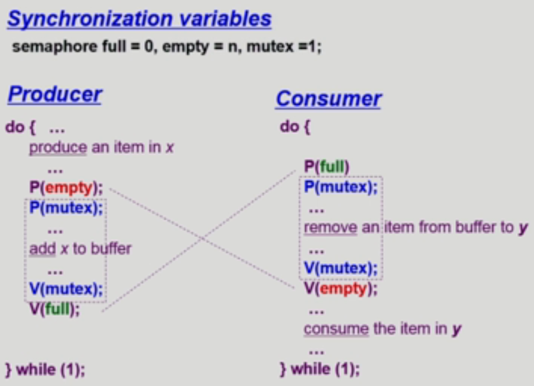
        </figure>

### 4-2-2. Readers-Writers Problem
- 한 프로세스가 DB에 Write 중일 때는 다른 프로세스가 접근하면 안되고, Read는 동시에 여럿이 접근해도 된다.
- 해결책
    - Writer가 DB에 접근 허가를 아직 얻지 못한 상태에서는 모든 대기중인 Reader들을 다 DB에 접근하게 해준다.
    - Writer는 대기중인 Reader가 하나도 없을 때 DB 접근이 허용된다.
    - 일단 Writer가 DB에 접근 중이면 Reader들은 접근이 금지된다.
    - Writer가 DB에서 빠져나가야만 Reader의 접근이 허용된다.<br><br>
- Shared Data
    ```C
    DB 자체
    readcount; /* 현재 DB에 접근 중인 Reader의 수 */
    ```
- Synchronization variables
    ```C
    mutex /* 공유 변수 readcount를 접근하는 코드(critical section)의 상호 배제 보장을 위해 사용 */
    db /* Reader와 Writer가 공유 DB 자체를 올바르게 접근하게 하는 역할 */
    ```

<figure>
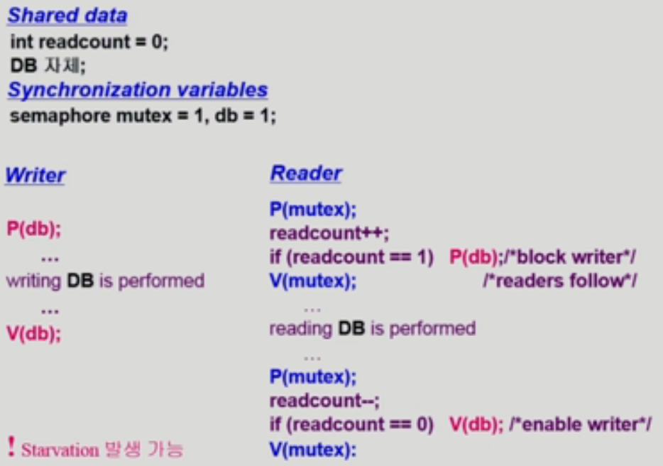
</figure>

- 시간에 대한 접근 권한을 주어 기아 현상 해결 가능

### 4-2-3. Dining-Philosophers Problem

<figure>
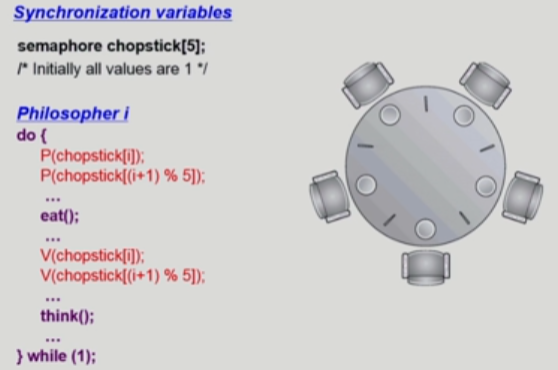
</figure>

- 문제점
    - Deadlock 가능성(모든 철학자가 동시에 배가 고파져 왼쪽 젓가락을 집어버린 경우)
- 해결 방안
    1. 4명의 철학자만이 테이블에 동시에 앉을 수 있도록 한다
    2. 젓가락을 두 개 모두 집을 수 있을 때만 젓가락을 집을 수 있게 한다
    3. 비대칭(짝수/홀수 철학자는 왼쪽/오른쪽 젓가락부터 집도록)


<figure>
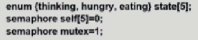<br>
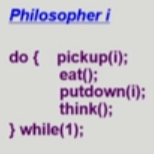<br>
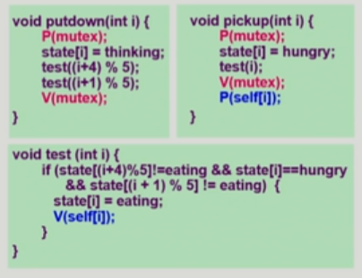
</figure>

# 5. Monitor
- Semaphore의 문제점
    - 코딩이 어렵다.
    - 정확성의 입증이 어렵다
    - 자발적 협력이 필요하다.
    - 한번의 실수가 모든 시스템에 치명적인 영향을 끼친다.<br>
<figure>
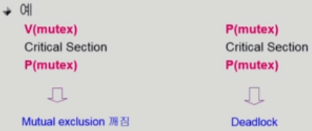
</figure>

## 5-1. Monitor
- 동시 수행중인 프로세스 사이에서 absract data type의 안전한 공유를 보장하기 위한 high-level synchronization construct<br>
    <figure>
    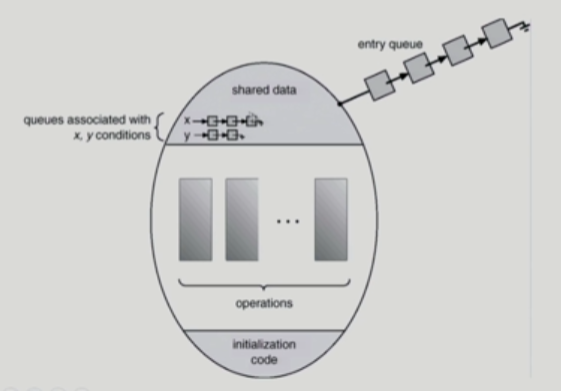
    </figure>
- Monitor Code<br>
    <figure>
    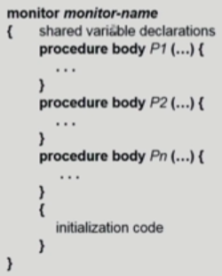
    </figure>


### Bounded-Buffer
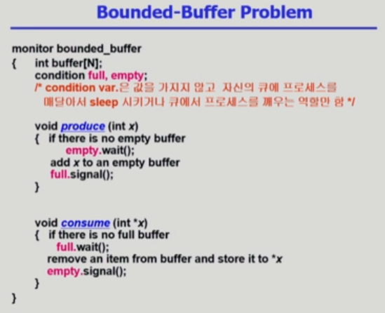

### Dining Philosophers
