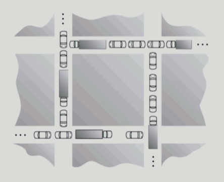
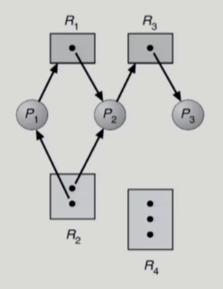
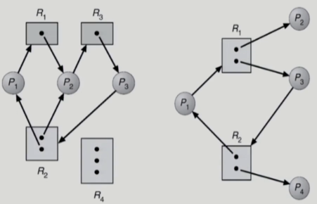
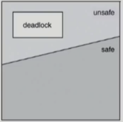
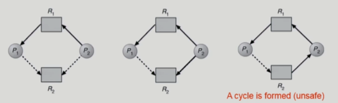
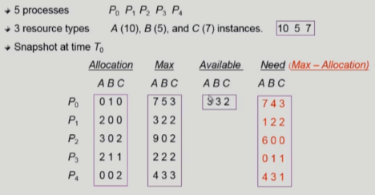
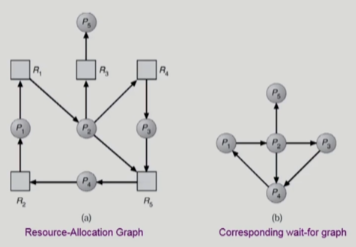
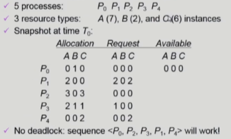

#### [전체 목차로 돌아가기](../README.md)

## 목차

# 1. Deadlock

- Deadlock : 일련의 프로세스들이 서로가 가진 자원을 기다리며 block 된 상태<br>
  <figure>
  
  </figure>
- Resource : 하드웨어, 소프트웨어 등에서 프로세스가 사용할 수 있는 요소들
  - ex : I/O device, CPU cycle, memory space, semaphore, etc...
  - 프로세스의 자원 사용 절차
    1. Request
    2. Allocate
    3. Use
    4. Release

## 1-1. Deadlcok 발생 조건

1. Mutual exclusion(상호배제)
   - 매 순간 하나의 프로세스만이 자원을 사용할 수 있음
2. No preemption(비선점)
   - 프로세스는 자원을 스스로 내어놓을 뿐 강제로 빼앗기지 않음
3. Hold and wait(보유 대기)
   - 자원을 가진 프로세스가 다른 자원을 기다릴 때 보유 자원을 놓지 않고 계속 가지고 있음
4. Circular wait(환형 대기)
   - 자원을 기다리는 프로세스 간에 사이클이 형성되어야 함

## 참고. 자원할당 그래프(Resource-Allocation Graph)

  <figure>
  
  </figure>
  
- Vertex
  - Process P : 각 프로세스를 나타내는 노드
  - Resource R : 각 자원을 나타내는 노드
- Edge
  - request edge (P -> R) : 프로세스가 자원을 요청함을 나타냄
  - assignment edge (R -> P) : 자원이 프로세스에 할당됨을 나타냄

### 자원 할당 그래프에서 Deadlock

<figure>

</figure>

- Deadlock 판단
  1. 그래프 내 Cycle 여부
  2. 자원 유형 당 할당된 인스턴스의 수
  ```
  그래프에 cycle이 없으면 deadlock이 아니다
  그래프에 cycle이 있을 경우,
    자원 유형당 하나의 인스턴스가 있다면, Deadlock 이고,
    자원 유형당 여러 인스턴스가 있다면, Deadlock 가능성이 있다고 한다.
  ```

## 1-3. Deadlock 처리 방법

### 1-3-1. Deadlock Prevention

- 자원 할당 시 Deadlock 의 4 가지 필요조건 중 어느 하나가 만족되지 않도록 하는 것

#### 처리 방법

1. Mutual Exclusion
   - 공유해서는 안되는 자원의 경우 상호 배제는 반드시 성립해야 함 (손대지 않음)
2. Hold and Wait
   - 프로세스가 자원을 요청할 때 다른 어떤 자원도 가지고 있지 않아야 한다
   - 방법 1. 프로세스 시작 시 모든 필요한 자원을 할당받게 하는 방법
   - 방법 2. 자원이 필요할 경우 보유 자원을 모두 놓고 다시 요청
3. No Preemption
   - 프로세스가 어떤 자원을 기다려야 하는 경우 이미 보유한 자원이 선점됨
   - 모든 필요한 자원을 얻을 수 있을 때 그 프로세스는 다시 시작된다.
   - State를 쉽게 save 하고 restore 할 수 있는 자원에서 주로 사용(CPU, memory)
4. Circular Wait
   - 모든 자원 유형에 할당 순서를 정하여 정해진 순서대로만 자원 할당

- 문제점
  - Utilization 저하, throughput 감소, starvation 문제

<hr>

### 1-3-2. Deadlock Avoidance

- 자원 요청에 대한 부가정보를 이용해서 자원 할당이 deadlock으로부터 안전한지를 동적으로 조사해서 안전한 경우에만 할당
- 가장 단순하고 일반적인 모델은 프로세스들이 필요로 하는 각 자원별 최대 사용량을 미리 선언하도록 하는 방법
- 시스템 state가 원래 state로 돌아올 수 있는 경우(safe)에만 자원 할당

#### Scheme

<figure>

</figure>

#### system state

- safe state : 시스템 내의 프로세스들에 대한 safe sequence가 존재하는 상태
- 시스템이 safe state에 있으면, No deadlock
- 시스템이 unsafe state에 있으면, Possibility of deadlock

#### safe sequence

- (현재 프로세스의 자원 요청)이 (가용 자원과 이전 프로세스들이 보유한 자원의 합)에 의해 충족된 상태
- safe sequence의 수행 방식 2가지
  1. 현재 프로세스의 자원 요청이 즉시 충족될 수 없으면 모든 이전 프로세스가 종료될 때까지 기다린다.
  2. 직전 프로세스가 종료되면 현재 프로세스의 자원 요청을 만족시켜 수행한다.

### 1. Resource Allocation Graph algorithm(Single instance)

- Claim edge (P -> R, 점선) : 프로세스가 자원을 미래에 요청할 수 있음을 나타냄
- 알고리즘 논리

  1. 프로세스가 해당 자원 요청하면 request edge (P -> R, 실선) 로 변경됨
  2. request edge의 assignment edge 변경 시 (점선 포함) cycle 이 생기지 않는 경우에만 요청 자원을 할당한다.
  3. 자원이 release되면 assignment edge (R -> P, 실선) 는 다시 claim edge(P -> R, 점선) 로 바뀜

  <figure>
  
  </figure>

- Cycle 생성 여부 조사시 프로세스의 수가 n 일 때 O(n^2) 시간이 걸린다.

### 2. Banker's algorithm(Multiple instance)

- 가정

  1. 모든 프로세스는 자원의 최대 사용량을 미리 명시한다.
  2. 프로세스가 요청 자원을 모두 할당받은 경우 유한 시간 안에 이들 자원을 다시 반납한다.

- 방법 : 자원 요청시 safe 상태를 유지할 경우에만 할당

  1. 총 요청 자원의 수가 가용 자원의 수보다 적은 프로세스를 선택하고, 할당

     - 위와 같은 프로세스가 없다면 unsafe 상태이다.

  2. 할당받은 프로세스가 종료되면 모든 자원을 반납
  3. 모든 프로세스가 종료될 때까지 반복

#### Example

- Table 이용<br>
  <figure>
  
  </figure>
- sequence 가 존재하여 시스템은 safe state 가 된다.

<hr>

### 1-3-3. Deadlock Detection and recovery

- Deadlock 발생은 허용하되 그에 대한 detection 루틴을 두어 deadlock 발견시 recovery

#### Deadlock Detection

1. Wait-for graph algorithm(Single instacne)

   - Single instace일 경우에는 자원 할당 그래프에서의 cycle이 곧 deadlock을 의미
   - 즉, 사이클 존재 여부를 주기적으로 조사(O(n^2))

    <figure>
    
    </figure>

   - 자원 할당 그래프의 변형으로, 프로세스만으로 node를 구성한다.
   - Pj가 가지고 있는 자원을 Pk가 기다리는 경우 (Pk -> Pj) 로 표현
   - 그래프에 점선이 없고, 자원의 최대 사용량을 미리 알릴 필요 없다.

2. Multiple instance

   - Banker's algorithm과 유사한 방법을 이용

    <figure>
    
    </figure>

   - 여기서, Request 는 추가요청가능량이 아니라 현재 실제로 요청한 자원량을 나타냄
   - Deadlock이 있는 경우, Recovery를 진행

<hr>

### Deadlock Recovery (2가지 방법)

1. Process trmination
   - 모든 데드락 프로세스를 Abort
   - 데드락이 풀릴 때 까지 프로세스를 하나씩 Abort
2. Resource Preemption
   - 비용을 최소화할 victim의 선정
   - safe state로 rollback하여 프로세스를 재실행
   - Starvation 문제
     - 동일 프로세스가 계속 victim으로 선정되는 경우
     - cost factor에 rollback 횟수도 같이 고려

<hr>

### 1-3-4. Deadlock Ignorance

- Deadlock이 일어나지 않는다고 생각하고 아무런 조치도 취하지 않음
  - Deadlock이 매우 드물게 발생하므로 deadlock에 대한 조치 자체가 더 큰 overhead일 수 있음
  - 만약, 시스템에 deadlock이 발생한 경우 시스템이 비정상적으로 작동하는 것을 사람이 느낀 후 직접 process를 죽이는 등의 방법으로 대처
  - UNIX, Windows를 포함한 대부분의 범용 OS가 채택
