#### [전체 목차로 돌아가기](../README.md)

## 목차

# 1. 메모리 관리

<p align="center"></p>

## 1-1. Logical vs. Physical Address

- Logical address(=virtual address)

  - 프로세스마다 독립적으로 가지는 주소 공간
  - 각 프로세스마다 0번지부터 시작
  - CPU가 보는 주소는 logical address이다.

- Physical address
  - 메모리에 실제 올라가는 위치

## 1-2. 주소 바인딩 (Address Binding)

- 주소 바인딩: 주소를 결정하는 것
  > Symbolic Address => Logical Address => Physical Address

<p align="center">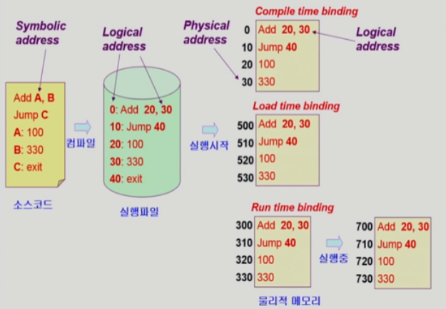</p>

1. Compile time binding

   - 물리적인 메모리 주소가 컴파일시 알려짐
   - 시작 위치 변경시 재컴파일
   - 컴퍼일러는 절대 코드(absolute code) 생성

2. Load time binding

   - Loader의 책임 하에 물리적 메모리 주소 부여
   - 컴파일러가 재배치 가능 코드(relocatable code)를 생성한 경우 가능

3. Execution time binding(=Run time binding)

   - 수행이 시작된 이후에도 프로세스의 메모리 상 위치를 옮길 수 있음
   - CPU가 주소를 참조할 때마다 binding을 점검 (address mapping table)
   - 하드웨어적인 지원이 필요(e.g., base and limit registers, MMU)

### 1-3. Memory-Management Unit(MMU)

- MMU

  > Logical Address를 Physical Address로 매핑해 주는 하드웨어 장치

- MMU scheme:

  > 사용자 프로세사가 CPU에서 수행되며 생성해내는 모든 주소값에 대해 base register(=relocation register)의 값을 더한다.

- user program:

  > logical address만을 다룬다.<br>
  > physical address를 볼 수 없으며, 알 필요도 없다.

- Hardware Support for Address Translation

  - Dynamic Relocation

   <p align="center">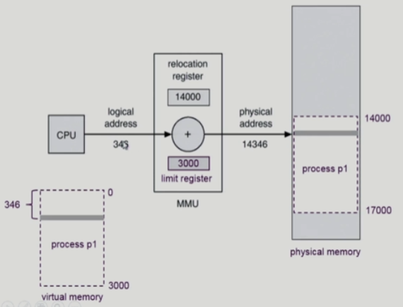</p>

  - 운영체제 및 사용자 프로세스 간의 메모리 보호를 위해 사용하는 레지스터

    - <span style="color:tomato">Relocation register(=base register)</span>:
      > 접근할 수 있는 물리적 메모리 주소의 최소값을 잡아줌
    - <span style="color:tomato">Limit register</span>:
      > 논리적 주소의 범위를 설정하여 trap 여부를 결정함

<p align="center">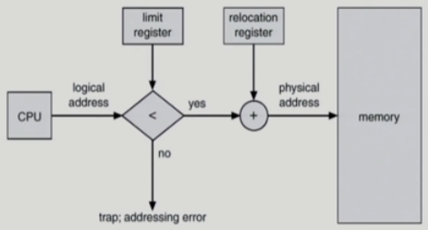</p>

## 2. Some Terminologies

### 2-1. Dynamic Loading

프로세스 전체를 메모리에 미리 다 올리는 것이 아니라 `해당 루틴이 불려질 때` 메모리에 load 하는 것

- 특징
  1. 메모리 Utilization의 향상
  2. 오류 처리 루틴과 같이 자주 사용되지 않으나, 많은 부피를 차지하는 경우 유용
  3. 운영체제의 특별한 지원 없이 프로그램 자체에서 구현 가능(OS는 라이브러리를 통해 지원 가능)

### 2-2. Overlays

메모리에 프로세스의 부분 중 `실제 필요한 정보만`을 올림

- 특징
  1. 프로세스의 크기가 메모리보다 클 때 유용
  2. 운영체제의 지원 없이 사용자에 의해 구현
  3. 작은 공간의 메모리를 사용하던 초창기 시스템에서 수작업으로 프로그래머가 구현(Manula Overlay)
  4. 프로그래밍이 매우 복잡함

### 2-3. Swapping

프로세스를 일시적으로 메모리에서 `backing store`로 쫒아내는 것

- Backing store(=swap area):

  > 많은 사용자의 프로세스 이미지를 담을 만큼 충분히 빠르고 큰 저장 공간<br>
  > 일반적으로 디스크를 이용

- Swap in / Swap out
  - 일반적으로 중기 `스커줄러(Swapper)`에 의해 Swap out 시킬 프로세스 선정
    ```
    priority-based CPU scheduling algorithm:
      - 우선순위가 낮은 프로세스를 Swap area에 Swap out
      - 우선순위가 높은 프로세스를 메모리에 Swap in
    ```
  - 주소 바인딩 방식에 따라,
    - Compile time binding / load time binding : 원래 메모리 위치로 swap in
    - Execution time binding : 빈 메모리 영역 아무곳이나 swap in
  - Swap time의 소요시간은 `Trasfer time(swap되는 양에 비례하는 시간)`에 의해 주로 결정된다.

<p align="center">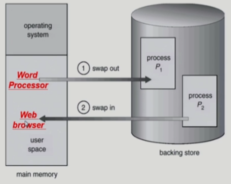</p>

### 2-4. Dynamic Linking

Linking 이란?

> 컴파일 이후, 만들어진 함수(라이브러리)가 프로그램 코드에 연결되는 작업

Static linking vs. Dynamic Linking

- Static linking(=>Static library)

  - 라이브러리가 프로그램의 실행 파일 코드에 포함됨
  - 실행 파일의 크기가 커짐
  - 동일한 라이브러리를 각각의 프로세스가 메모리에 올리므로 메모리 낭비가 있음

- Dynamic linking(=>Shared library) (.so, .dll)
  - 라이브러리가 실행시 연결됨
  - 라이브러리 호출 부분에 라이브러리 루틴의 위치를 찾기 위한 stub이라는 작은 코드를 둠
  - 라이브러리가 이미 메모리에 있으면 그 루틴의 주소로 가고, 없으면 디스크에서 읽어옴
  - 운영체제의 도움이 필요

## 3. 물리적 메모리의 할당

- 메모리는 일반적으로 두 영역으로 나뉘어 사용

  - OS 상주 영역:
    > interrupt vector와 함께 낮은 주소 영역 사용
  - 사용자 프로세스 영역:
    > 높은 주소 영역 사용

### 3-1. 연속 할당

---

각각의 프로세스가 메모리의 연속적인 공간에 적재되도록 하는 것

#### 3-1-1. 분할 방식

1. 고정 분할 방식

   - 방법

     - 물리적 메모리를 고정된 크기로 몇 개의 영구적 분할(partition)로 나눔
     - 분할의 크기가 모두 동일한 방식 / 각 분할마다 크기가 서로 다른 방식
     - 분할당 하나의 프로그램을 적재

   - 특징

     - 융통성이 없음
     - 동시에 메모리에 load 되는 프로그램의 수가 고정됨
     - 최대 수행 가능 프로그램 크기가 제한됨
     - 내부(internal) / 외부(external) fragmentation이 발생할 수 있음

   <p align="center">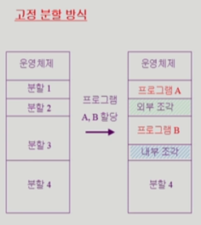</p>

2. 가변 분할 방식

   - 방식

     - 물리적 메모리를 분할(partition)로 나눔
     - 프로그램의 크기를 고려해서 할당
     - 분할의 크기, 개수가 동적으로 변함

   - 특징

     - 기술적 관리 기법 필요
     - 외부 조각이 발생

  <p align="center">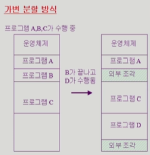</p>

#### 3-1-2. Hole (=가용 메모리 공간)

- 다양한 크기의 hole 들이 메모리 여러 곳에 흩어져 있음
- 프로세스가 도착하면 수용 가능한 hole을 할당
- 운영체제는 `할당공간`과 `가용공간`의 정보를 유지

#### 3-1-3. Dynamic Storage-Allocation Problem

가변 분할 방식에서 size n인 요청을 만족하는 가장 적절한 hole을 찾는 문제

1. First-fit
   - 사이즈가 n 이상인 것 중 최초로 찾아지는 hole에 할당
2. Best-fit
   - 사이즈가 n 이상인 가장 작은 hole을 찾아서 할당
   - hole 등릐 리스트가 크기순으로 정렬되지 않은 경우 모든 hole의 리스트를 탐색해야 함
   - 많은 수의 아주 작은 hole들이 생성됨
3. Worst-fit
   - 가장 큰 hole에 할당
   - 역시 모든 리스트를 탐색해야 함
   - 상대적으로 아주 큰 hole들이 생성됨

- First-fit 과 best-fit 이 worst-fit 보다 속도와 공간 이용률 측면에서 효과적인 것으로 알려짐

#### 3-1-4. Compaction

외부 조각 문제를 해결하는 한 가지 방법:

> 사용중인 메모리 영역을 한구데로 몰고 hole 들을 다른 한 곳으로 몰아 큰 block을 만드는 것

- 특징
  - 매우 비용이 많이 드는 방법
  - 최소한의 메모리 이동으로 compaction 하는 방법은 매우 복잡한 문제이다.
  - Compaction은 프로세스의 주소가 실행 시간에 동적으로 재배치 가능한 경우에만 수행될 수 있다.

### 3-2. 불연속 할당

---

하나의 프로세스가 메모리의 여러 영역에 분산되어 올라갈 수 있음

1. 페이징
2. 세그멘테이션
3. 페이지드 세그멘테이션

## 4. 페이징

- 페이징이란?

  > 프로세스의 가상 메모리를 동일한 사이즈의 페이지 단위로 나눔<br>
  > 가상 메모리의 내용이 페이지 단위로 `불연속적`으로 저장됨<br>
  > 일부는 Backing storage에, 일부는 물리적 메모리에 저장됨

- Basic Method

  - 물리적 메모리를 동일한 크기의 `frame`으로 나눔
  - 논리적 메모리를 동일한 크기의 `page`로 나눔(frame과 같은크기)
  - 모든 가용 frame을 관리
  - `page table`을 이용하여 논리주소를 물리주소로 변환

- 특징

  - 외부 조각 발생 안함
  - 내부 조각 발생 가능

### 4-1. Scheme

  <p align="center">
  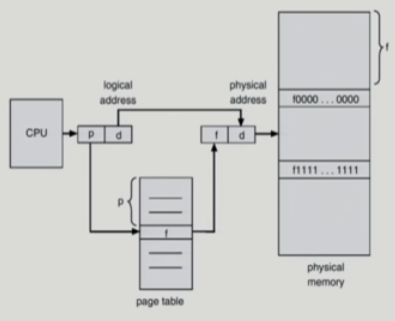
  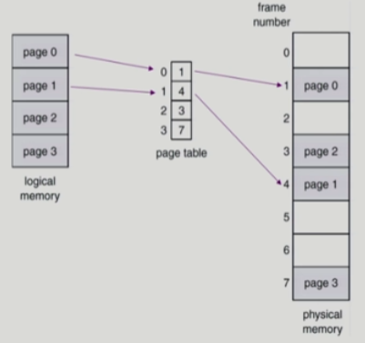
  </p>

- CPU가 사용하는 가상 주소

  - Page number (p): page table의 index로, 해당 index에는 그 페이지의 물리적 메모리 상의 base address가 저장됨
  - Page offset(d): bass address와 더해져서 물리주소가 구해짐

### 4-2. 페이지 테이블의 구현

- 페이지 테이블의 특징

  - 페이지 테이블은 메인 메모리에 상주한다.
  - 모든 메모리 접근 연산에 2번의 memory access가 필요하다. (page table 1번, data/instrction 1번)
  - 속도 향상을 위해 associative register 혹은 translation look-aside buffer(TLB)라고 불리는 고속의 lookup hardware cache 사용

- 페이지 테이블 구현에 필요한 레지스터

  - PTBR(Page-table base register):
    > 페이지 테이블을 가리키는 레지스터
  - PTLR(Page-tabe length register):
    > 테이블의 크기를 보관하는 레지스터

### 4-3. Assocoatove Register(TLB)

> 페이지 테이블 구현에 의해 야기되는 속도 저하를 극복하기 위해 사용하는 고속의 lookup hardware cache

- TLB Scheme

  <p align="center">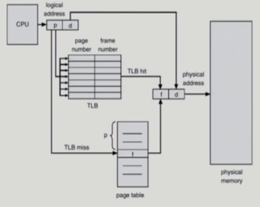</p>

  - TLB에는 페이지 테이블의 일부만 존재함

- 주소 전환 과정:
  ```
  페이지 테이블 중 일부가 associative register에 보관되어 있고,
    (TLB Hit) 만약 해당 페이지가 있는 경우 곧바로 프레임 번호를 얻음
    (TLB Miss) 그렇지 않은 경우, 메인 메모리에 있는 페이지 테이블로부터 프레임 번호를 얻음
  ```
- 특징

  - TLB는 문맥 교환이 일어날 경우, 모든 엔트리를 제거한다.(flush)

#### 접근 시간의 효율 계산(EAT)

  <p align="center">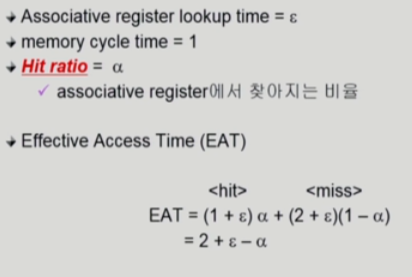</p>

### 4-4. Two-Level Page Table

  <p align="center">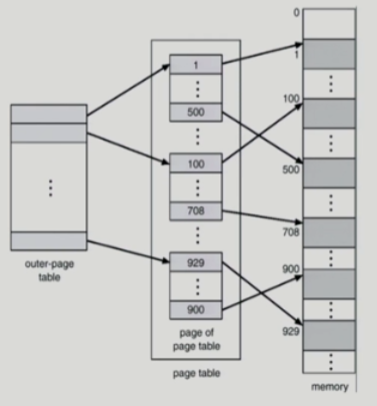</p>

현대의 컴푸터는 주소 공간이 매우 큰 프로그램을 지원한다. (32bit => 4G)

```
페이지 사이즈 4K = 페이지 테이블 엔트리 1M
페이지 엔트리 4B = 프로세스당 4M의 페이지 테이블 필요
```

즉, 대부분 프로그램은 주소공간 중 지극히 일부만 사용하므로 페이지 테이블 공간이 심하게 낭비된다. 따라서, 페이지 테이블 자체를 페이지로 구성하여 사용되지 않는 주소 공간에 대한 `outer 페이지 테이블`의 엔트리값을 Null로 하여 메모리 공간을 아낀다.

- 예시
  <p>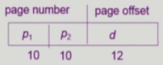</p>

  ```
  p1, p2 : 논리 주소의 페이지 번호
      p1 : outer 페이지 테이블의 번호
      p2 : outer 페이지 테이블의 오프셋
  d : 논리 주소의 페이지 오프셋
  ```

  <p align="center">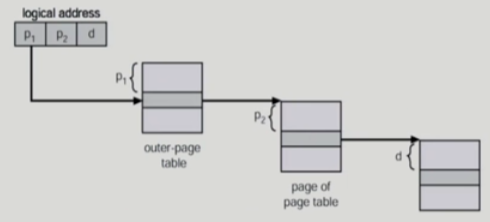</p>

### 4-5. Multilevel Paging and Performance

주소 공간이 더 커지면 다단계 페이지 테이블이 필요하지만, 각 단계의 페이지 테이블이 메모리에 존재하므로 논리주소에서 물리주소로 변환하는데 더 많은 메모리 접근이 필요하다.(TLB를 통해 메모리 접근 시간을 줄여야 한다.)

- 예시(4단계 페이지 테이블)

  <p align="center">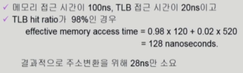</p>

### 4-6. Memory Protection

페이지 테이블의 각 엔트리마다 아래의 비트를 둔다.

- Protection bit:

  > 페이지에 대한 접근 권한 (read/write/read-only)

- Valid / Invalid Bit

    <p>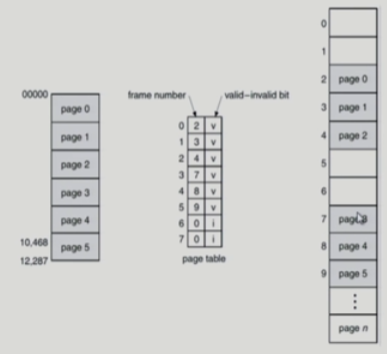</p>

  - `valid`는 해당 주소의 프레임에 그 프로세스를 구성하는 유효한 내용이 있음을 뜻함(접근 허용)
  - `invalid`는 해당 주소의 프레임에 유효한 내용이 없음을 뜻함 (접근 불허)

### 4-7. Inverted Page Table

```
페이지 테이블은 모든 프로세스 별로 그 논리주소에 대응하는 모든 페이지에 대해 대응하는 페이지가 메모리에 있든 아니든 간에 페이지 테이블 엔트리가 존재하기 때문에 매우 큰 메모리 공간을 차지한다.
Inverted 페이지 테이블은 페이지 프레임 하나당 페이지 테이블에 하나의 엔트리를 두어(system-wide) 각 페이지 테이블 엔트리에 각각 물리적 메모리의 페이지 프레임이 담고 있는 내용을 표시한다.(pid와 프로세스의 논리주소)
```

  <p align="center"></p>

- 특징
  - 물리주소를 이용하여 논리주소를 얻어내는데 유리한 테이블
  - 그러나 CPU에서 논리주소를 물리주소로 변경하는 것이므로 효율적이진 않음...
  - pid를 이용하여 페이지 테이블을 모두 검색해야 함
  - 메모리 공간 오버헤드는 줄어들 수 있으나, 페이징을 사용하는 의미가 사라짐
  - 비싼 Associative register를 사용하면 극복 가능

### 4-8. Shared Page

  <p align="center">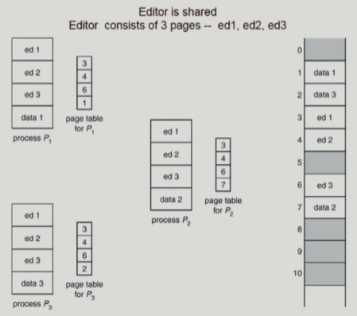</p>

- Shared code (= Re-entrant code, Pure code)

  - 조건1: read-only로 하여 프로세스 간에 하나의 code만 메모리에 올림.
  - 조건2: 공유 코드는 모든 프로세스의 논리주소공간에서 동일한 위치에 있어야 함
  - 예시: text editors, compilers, window system

- Private code and data
  - 각 프로세스들은 독자적으로 메모리에 올림
  - Private data는 논리주소공간의 아무 곳에 와도 무방

## 5. 세그멘테이션

> 프로그램을 구성하는 의미단위인 Segment로 분할하는 방식

> 작게는 프로그램을 구성하는함수 하나하나를, 크게는 프로그램 전체를 하나의 세그먼트로 정의 가능<br>
> 일반적으로는 code, data, stack 부분이 하나씩 세그먼트로 정의된다.

- Segment Ex.

  ```
  main(),
  function,
  global variables,
  stack,
  symbol table, arrays
  ```

### Architectre

1. 논리주소 : segment-number, offset으로 구성
2. 세그먼트 테이블

- base: 세그먼트의 물리주소가 시작되는 곳(byte 단위)
- limit: 세그먼트의 길이

3. 레지스터

   - STBR(Segment-table base register):
     > 물리적 메모리에서의 segment table의 위치
   - STLR(Segment-table lenght register):
     > 프로그램이 사용하는 segment의 수<br>
     > segment # < STLR 일 경우, trap

4. Protection

   > segment는 의미 단위이기 때문에 공유와 보안에 있어서 페이징보다 유리하다.

   - 각 세그먼트별 protection bit 존재
   - 각 엔트리별
     - Valid bit = 0 => illegal segment
     - Read/Write/Execution 권한 bit

5. Sharing

   > segment는 의미 단위이기 때문에 공유와 보안에 있어서 페이징보다 유리하다.

   - Shared segment
   - same segment number

6. Allocation

   > segment의 길이가 동일하지 않으므로 가변 분할 방식에서와 동일한 문제점들이 발생

   - first fit / best fit
   - external fragmentation 발생

### 세그먼트 하드웨어

  <p align="center">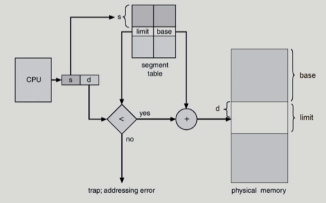</p>

### 세그먼테이션 예시

  <p align="center">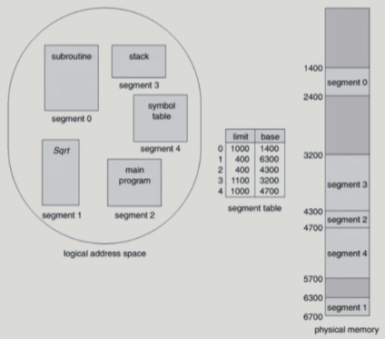</p>

## 6. Paged Segmentation

페이징 기법과 세그멘테이션을 혼합한 기술, 세그먼트가 여러개의 페이지로 구성됨

- Pure segmentation과의 차이점

  > `segment-table entry`가 *segment*의 `base address`를 가지고 있는 것이 아니라 *segment*를 구성하는 `page table`의 `base address`를가지고 있음

  <p align="center">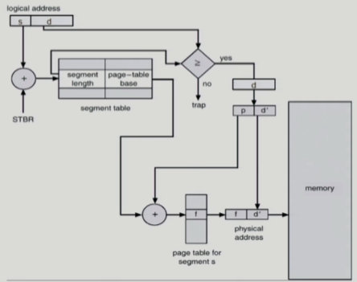</p>
