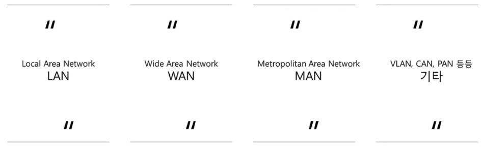
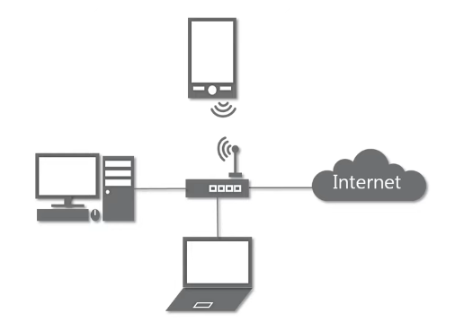
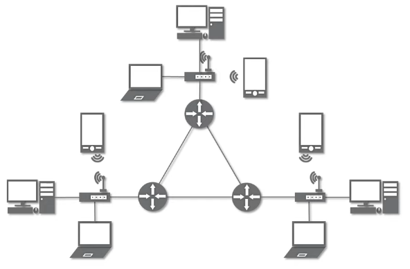
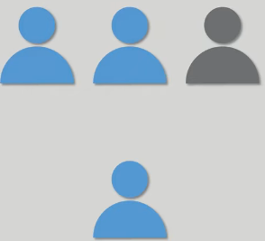
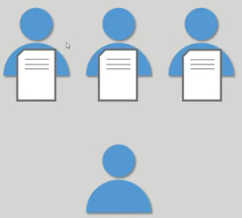
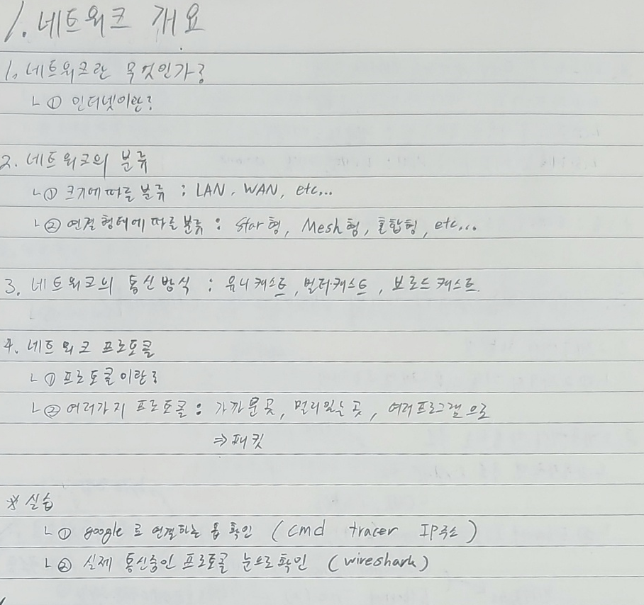

# 1. 네트워크 개요

## 1-1. 네트워크란 무엇인가?
1. 네트워크란?
    - **노드**들이 데이터를 공유할 수 있게 하는 디지털 전기**통신망**의 하나이다.
2. 인터넷이란?
    - 여러가지 데이터를 **공유**하도록 구성된 세상에서 가장 큰 전세계를 연결하는 **네트워크**

## 1-2. 네트워크의 분류
1. 크기에 따른 분류
        <figure>
        
        </figure>
    - LAN : 가까운 지역을 하나로 묶은 네트워크
    - WAN : 멀리 있는 지역을 한데 묶은 네트워크, LAN과 LAN을 묶은 것
      
2. 연결 형태에 따른 분류
        <figure>
        
        </figure>
    - Star 형 : 중앙 장비에 모든 노드가 연결된 형태
        - 중앙 장비가 고장날 경우 모든 기기의 네트워크가 고장난다.
        <figure>
        
        </figure>
    - Mesh 형 : 여러 노드들이 서로 그물처럼 연결된 형태
        - 설치 비용이 많이 든다는 단점이 있다.
        <figure>
        
        </figure>
    - 혼합형 : 실제 인터넷이 많이 가용하는 형태
        <figure>
        
        </figure>

## 1-3. 네트워크의 통신 방식
1. 네트워크에서 데이터는 어떻게 주고 받는가?
    - 유니 캐스트 : 특정 대상이랑만 1:1로 통신
        <figure>
        
        </figure>
    - 멀티 캐스트 : 특정 다수와 1:N 으로 통신
        <figure>
        
        </figure>
    - 브로드 캐스트 : 네트워크에 있는 모든 대상과 통신
        <figure>
        
        </figure>

## 1-4. 네트워크 프로토콜
1. 프로토콜이란?
    - 노드간 통신에서 **어떤 노드**가 **어느 노드**에게 **어떤 데이터**를 **어떻게** 보내는지 작성하기 위한 양식
2. 여러가지 프로토콜
    - 가까운 곳과 연락할 때 : Ethernet (MAC 주소)
    - 멀리 있는 곳과 연락할 때 : ICMP, IPv4, ARP (IP 주소)
    - 프로그램으로 연락할 때 : TCP, UDP (포트 번호)

  

<figure>

</figure>