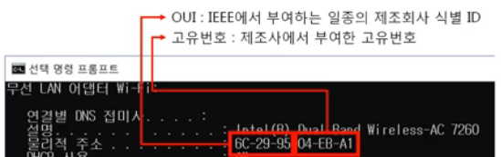
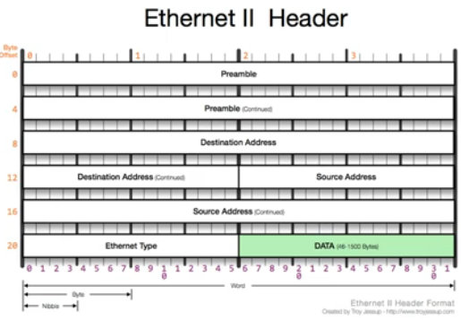

# 3. 2계층 (이더넷)

## 3-1. 2계층에서 하는 일
1. 2계층의 기능
    - **하나의 네트워크 대역(LAN)**에서 **어떤 장비**가 **어떤 장비**에게 보내는 데이터를 전달
    - **오류제어**, **흐름제어** 수행
    - 다른 네트워크와 통신할 때는 **3계층**이 도와주어야 한다.

## 3-2. 2계층에서 사용하는 주소
1. 물리적인 주소
    - MAC 주소 : LAN에서 통신할 때 사용 
        <figure>
        
        </figure>

## 3-3. 2계층 프로토콜
1. Ethernet 프로토콜
    - LAN에서 통신할 때 사용 
        <figure>
        
        </figure>
    - Preamble (8) : 수신 시스템에 프레임의 도착을 알림 (중요X)
    - Destination/Source Address (6, 6) : 목적지와 출발지의 MAC 주소
    - Ethernet Type (2) : 페이로드 내부의 상위 프로토콜에 대한 정보
    - Data (~): 페이로드

 

<figure>

</figure>