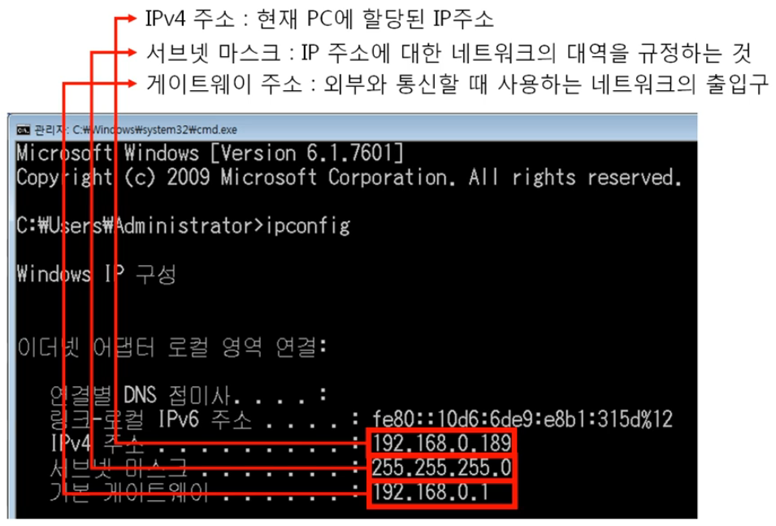
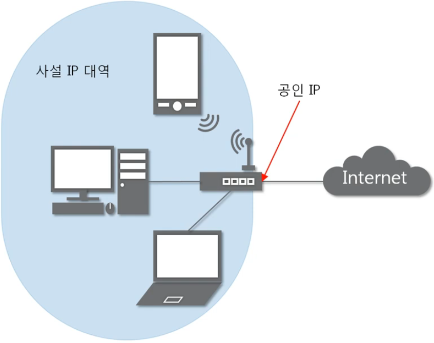

# 4. IP 주소

## 4-1. 3계층의 기능
1. 3계층에서 하는 일
    - 다른 네트워크 대역(WAN)으로 어떻게 데이터를 전달할지 제어하는 역할
    - 발신에서 착신까지 패킷의 경로를 제어
2. 3계층에서 쓰는 주소
    - IP 주소 : WAN에서 통신할 때 사용 
        <figure>
        
        </figure>
3. 3계층 프로토콜
    - ARP, IPv4, IPv6, ICMP

## 4-2. 일반적인 IP 주소
1. Classful IP 주소 
        <figure>
        
        </figure>
    - 클래스별로 네트워크 대역을 나눠 **낭비가 심함**
2. Classless IP 주소 
        <figure>
        
        </figure>
    - 서브넷 마스크를 이용하여 네트워크 대역과 기기를 구분함
3. 사설IP와 공인IP
    - 사설IP : 같은 네트워크 대역(LAN)에서 사용하는 IP
    - 공인IP : 외부 네트워크 대역(WAN)으로 나갈 때 사용하는 IP 
        <figure>
        
        </figure>
    - NAT(Network Address Translation)가 필요

## 4-3. 특수한 IP 주소
1. 0.0.0.0 (Wildcard)
    - 나머지 모든 IP를 의미
2. 127.0.0.X
    - 자기 자신을 나타내는 IP 주소
3. 게이트웨이 주소
    - 일반적으로 공유기의 IP
    - LAN에서 WAN으로 나갈때 이용하는 IP
    - 사설IP 대역에서 가장 낮거나 가장 높은 IP 주소를 사용 
        <figure>
        
        </figure>

 

<figure>

</figure>