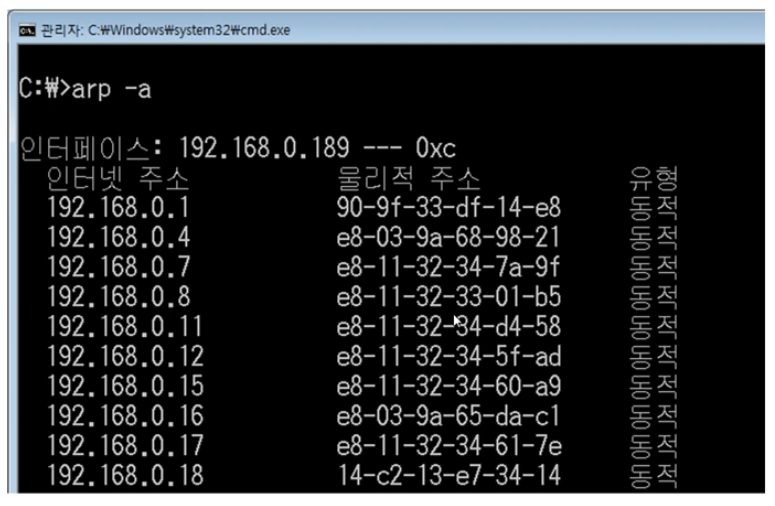

# 5. 3계층 (ARP)

## 5-1. ARP 프로토콜
1. ARP가 하는 일
    - LAN 통신을 하기 위해 필요한 MAC 주소를 IP 주소를 이용해서 알아오는 프로토콜
2. ARP 프로토콜의 구조 
        <figure>
        
        </figure>
    - Hardware Type, Address Length (2, 1): 2계층의 프로토콜 타입과 길이 (이더넷 : 0001, 06)
    - Protocol Type, Address Length (2, 1): 소스 프로토콜에서 사용하는 프로토콜 타입과 길이 (IPv4 : 0800, 04)
    - Opcode (2): 요청(01)인지 혹은 응답(02)인지를 나타내는 코드
    - Source/Destination Hardware/Protocol Address (6, 6, 4, 4): 출발지/목적지의 MAC/IP 주소

## 5-2. ARP 프로토콜의 통신 과정
1. 요청
    1. ARP 요청 : 모르는 목적지 MAC 주소를 0- 으로 작성
    2. Ethernet 캡슐화 : 모르는 목적지 MAC 주소를 F- 로 작성하여 브로드캐스트 유도
2. 스위치 : 2계층 확인 후 브로드캐스팅
    1. 각 PC에서 3계층 확인 후 IP 주소가 맞지 않으면 버리고, 맞으면 응답
3. 응답
    1. ARP 응답 : 자기 MAC 주소화 함께 Opcode=02 작성
    2. Ethernet 캡슐화 : 목적지 MAC (기존 소스 MAC) 작성
4. 기존 PC에서 ARP 캐시 테이블에 저장

## 5-3. ARP 테이블
1. 나와 통신했던 컴퓨터들
    - 일정 기간동안 ARP 테이블에 주소를 저장한다. 
        <figure>
        
        </figure>

 

<figure>

</figure>