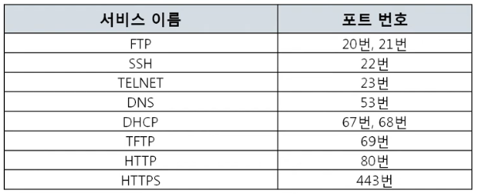
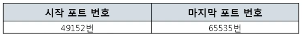

# 7. 4계층(TCP, UDP)

## 7-1. 4계층 프로토콜
1. 4계층에서 하는 일
    - 송신자의 **프로세스**와 수신자의 **프로세스**를 **연결하는 통신서비스**를 제공
2. 4계층 프로토콜의 종류
    - UDP : 비연결 지향 프로토콜
    - TCP : 연결 지향 프로토콜

## 7-2. 포트 번호
1. 포트번호의 특징
    - 하나의 포트는 하나의 프로세스만 사용 가능하다.
    - 일반적으로 정해져있지만, 무조건 지켜야 하는 것은 아니다.
2. Well-Known 포트 
    <figure>
    
    </figure>
3. Registered 포트 
    <figure>
    
    </figure>
4. Dynamic 포트 
    <figure>
    
    </figure>'

## 7-3. 프로그램의 연결 정보
1. 나와 현재 연결되어 있는 컴퓨터들
    - netstat -ano 
        <figure>
        
        </figure>    

 

<figure>

</figure>