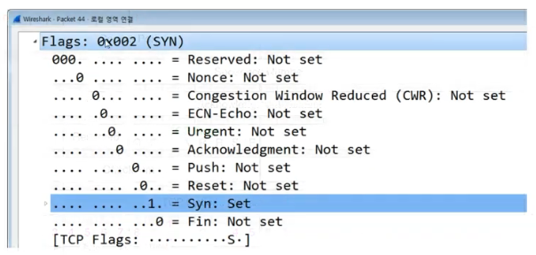
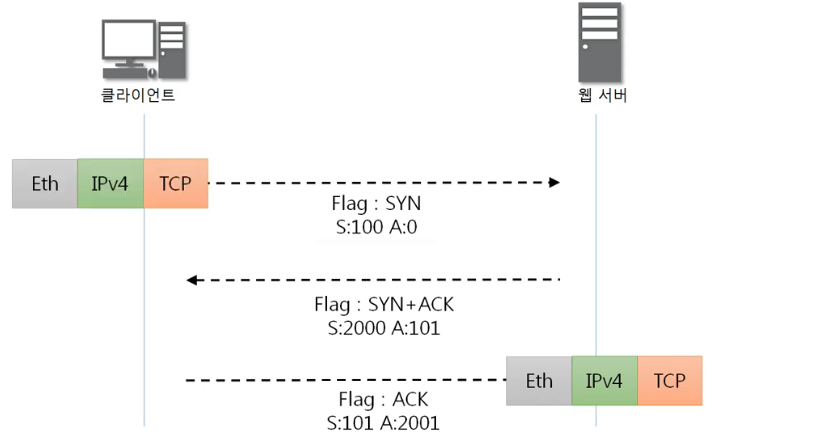
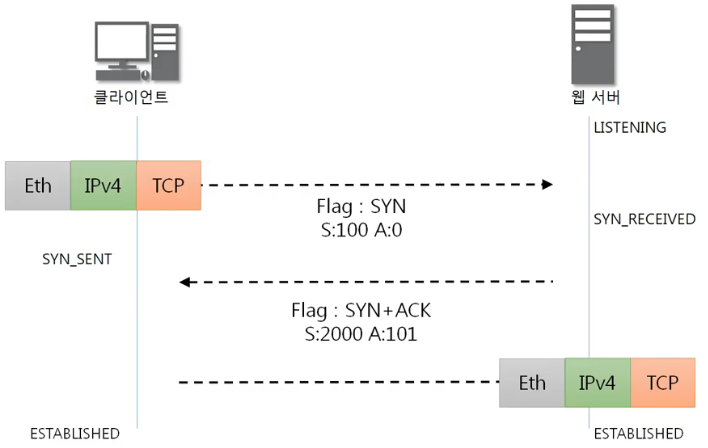

##### [돌아가기](./README.md)
# 9. 연결지향형 TCP 프로토콜

## 9-1. TCP 프로토콜
1. TCP가 하는 일
    - 인터넷에 연결된 컴퓨터에서 실행되는 프로그램 간에 통신을 **안정적으로, 순서대로, 에러없이** 교환할 수 있게 한다.
    - TCP는 UDP보다 안정적이지만 느리다.
2. TCP 프로토콜의 구조 
        <figure>
        
        </figure>
    - Source/Destination Port (2, 2): 포트 번호
    - Sequence Number (4): Seq 번호
    - Acknowledgment Number (4): Ack 번호
    - Offset (0.5): 헤더의 길이/4
    - Reserved (0.5): 예약된 필드 (사용하지 않음)
    - **TCP Flags** (1): 중요! 아래에서 설명
    - Window (2): 남은 TCP 버퍼의 용량을 표시
    - Checksum (2): 헤더의 오류를 확인
    - Urgent Pointer (2): Flag와 함께 설명
    - TCP Options (4~40): 추가 옵션 부분 (거의 안씀)

## 9-2. TCP 플래그
1. TCP Flags : C E U A P R S F
    - C, E : 거의 안씀
    - U (Urgent Flag): 데이터가 긴급한 데이터라는 표시 (Urgent Pointer가 어디부터 긴급한지 표시해줌)
    - **A (Ack Flag)**: 승인비트. 요청에 대한 응답.
    - P (Push Flag): TCP 버퍼와 상관없이 데이터를 넣어줌.
    - R (Reset Flag): 연결된 상태에서 문제가 생겼을 때 새로 연결하는 리셋 플래그.
    - **S (Syn Flag)**: 동기화비트. 둘 사이의 연결이 동기화되는 비트.
    - F (Fin Flag): 연결종료비트. 연결 종료시 사용. 
        <figure>
        
        </figure>

## 9-3. TCP를 이용한 통신 과정
1. 연결 수립 과정
    - TCP를 이용하는 통신에서 가장 먼저 수행되는 과정
    - 3-Way Handshake: 클라이언트와 서버의 3단계 연결 과정 
        <figure>
        
        </figure>
    - 데이터 송수신 과정: Seq, Ack 번호를 그대로 시작 
        <figure>
        
        </figure>
    
## 9-4. TCP 상태전이도
1. TCP 연결 상태의 변화 
        <figure>
        
        </figure>
    - Closed : 클라이언트 기본 상태
    - Listen : 서버 기본 상태
    - Active : 클라이언트의 동작
    - Passive : 서버의 동작
    - Established : 둘 모두 연결된 상태
2. 3-Way Handshake와 함께 보기 
        <figure>
        
        </figure>

 

<figure>

</figure>