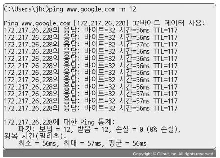
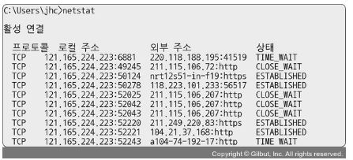

#### [전체 목차로 돌아가기](../README.md)
## 1. 네트워크 성능 분석
애플리케이션 코드상에는 전혀 문제가 없는데 사용자가 서비스로부터 데이터를 가져오지 못하는 상황이 발생하기도 하며, 이는 네트워크 병목 현상일 가능성이 있음

네트워크 병목현상의 주된 원인
- 네트워크 대역폭
- 네트워크 토폴로지
- 서버 CPU, 메모리 사용량
- 비효율적인 네트워크 구성

## 2. 네트워크 성능 분석 명령어
### ping(Packet INternet Groper)
- 네트워크 상태를 확인하려는 대상 노드를 향해 일정 크기의 패킷을 전송하는 명령어 
    <figure>
    
    </figure>
- 명령어
    - ping [IP 또는 도메인 주소]  
- 정보:
    - 노드의 패킷 수신 상태 및 소요 시간
    - 연결여부  
- ICMP 프로토콜 사용
    - ICMP를 지원하지 않거나 traceroute를 차단해놓은 경우 사용이 불가능하다.

### netstat
- 접속되어 있는 서비스들의 네트워크 상태를 표시. 주로 서비스의 포트가 열려있는지 확인할 때 사용한다. 
    <figure>
    
    </figure>
- 명령어
    - netstat
- 정보:
    - 네트워크 접속
    - 라우팅 테이블
    - 네트워크 프로토콜

### nslookup
- DNS에 관련된 내용을 확인하기 위해 쓰는 명령어. 주로 특정 도메인에 매핑된 IP를 확인하기 위해 사용 
    <figure>
    
    </figure>
- 명령어
    - nslookup 

*DNS : IP 주소 및 기타 데이터를 저장하고 이름별로 쿼리할 수 있게 해주는 계층형 분산 데이터베이스

### tracert
- 목적지 노드까지 네트워크 경로를 확인할 때 사용하는 명령어. 목적지 노드까지의 구간들 중 어느 구간에서 응답 시간이 느려지는지 등을 확인 
    <figure>
    
    </figure>
- 명령어
    - tracert [IP 또는 도메인 주소]  
- 윈도우에서는 tracert, 리눅스에서는 traceroute로 구동된다.

### 기타
- ftp : 대형 파일을 전송하여 테스팅
- tcpdump : 노드로 오고 가는 패킷을 캡처
### 네트워크 분석 프로그램
- wireshark, netmon
