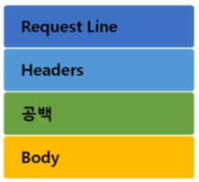

##### [돌아가기](./README.md)
# 11. 7계층 (HTTP)

## 11-1. HTTP 프로토콜
1. 웹을 만드는 기술들 
        <figure>
        
        </figure>
    - HTTP : 웹 표준을 전송하는 프로토콜
    - HTML, Javascript, CSS : 웹 표준, 웹 페이지의 내용, 기능, 디자인
    - ASP/ASP.NET, JSP, PHP : 서버에서 실행되는 코드 (MS, Java, PHP 기반 언어)
    - DB : 데이터 베이스
2. HTTP 프로토콜의 특징
    - 요청/응답 동작에 기반하여 서비스 제공
    - 1.0 버전 : 단순히 HTML 문서를 보내는 용도, 연결 한번에 한번연결
        - 통신 부하의 문제 
        <figure>
        
        </figure>
    - 1.1 버전 : 연결후 파일전송이 끝날 때 까지 유지 
        <figure>
        
        </figure>

## 11-2. HTTP 요청 프로토콜
1. HTTP 요청 프로토콜의 구조 
        <figure>
        
        </figure>
    1. Request Line : 요청타입, 공백, URI, 공백, HTTP 버전 
        <figure>
        
        </figure>
    2. Headers
    3. 공백
    4. Body
    - 요청 타입들  
            <figure>
            
        - GET : 클라이언트가 서버에게 데이터를 요청, 전송도 가능
        - POST : 클라이언트가 서버에 테이터를 전송, 요청도 가능
    - GET vs. POST :
        - GET은 URI에 데이터를 포함시켜서 보내게 되고, POST는 BODY에 포함되어 되돌아온다. 즉, 데이터 보안과 연관되어 있다.
    - URI : 인터넷 상에서 특정 자원을 나타내는 유일한 주소
        - scheme://host[:port][/path][?query]
          - scheme: 프로토콜
          - host[:port] : IP[:port] or 도메인주소
          - [/path] : 파일/폴더 경로
          - [?query] : 파일에 전달할 변수들

## 11-3. HTTP 응답 프로토콜

## 11-4. HTTP 헤더 포멧

 

<figure>

</figure>