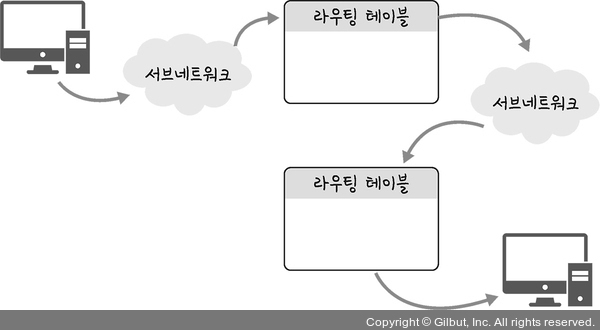

#### [전체 목차로 돌아가기](../../README.md)
## 1. 3계층의 기능
1. 3계층에서 하는 일
    - 다른 네트워크 대역(WAN)으로 어떻게 데이터를 전달할지 제어하는 역할
    - 발신에서 착신까지 패킷의 경로를 제어  
2. 3계층에서 쓰는 주소
    - IP 주소 : WAN에서 통신할 때 사용 
        <figure>
        
        </figure>
3. 3계층 프로토콜
    - ARP, IPv4, IPv6, ICMP

## 2. 홉 바이 홉 (hop by hop)
- IP 주소를 통해 통신하는 과정을 홉 바이 홉 통신이라고 한다.
- 이때, 홉은 통신에서 컴퓨터 사이의 거리를 통과한 라우터의 갯수를 셀 때 사용하는 단위이다.  
- 라우터에 있는 라우팅 테이블의 IP를 기반으로 패킷을 전달하는 과정을 반복하여 통신이 일어난다. 
    <figure>
    
    </figure>

### 라우팅 테이블 (네트워크에 대한 지도)
- 송신지에서 수신지까지 도달하기 위해 어디로 보내야 하는지에 대한 정보가 설정되어 있다.
- 게이트워이(0.0.0.0)와 모든 목적지에 대해 목적지로 도달하기 위해 거쳐야 할 다음 라우터에 대한 정보를 가지고 있다.
- 보통 목적지가 테이블에 없을 경우 기본값으로 게이트웨이로 보내도록 설정되어 있다. 
    <figure>
    
    </figure>

### 게이트 웨이
- 서로 다른 통신망, 프로토콜을 사용하는 네트워크 간의 통신을 가능하게 하는 관문 역할을 하는컴퓨터나 소프트웨어를 일컫는 용어
- 사용자는 인터넷에 접속하기 위해 수많은 게이트웨이를 거쳐야 하며 게이트웨이는 서로 다른 네트워크 상의 통신 프로토콜을 변환해주는 역할을 함
- 게이트 웨이 확인 법 : netstat -r 명령어 실행시 라우팅 테이블을 통해 볼 수 있다.

## 3. 다른 네트워크와 통신 과정
1. 요청
    1. ICMP 작성 : 요청(08)
    2. IPv4 작성 : ...
    3. Ethernet 작성 : 목적지 MAC을 LAN의 라우터로 작성  
2. 전송
    1. 라우터가 2계층 확인 후 재작성
    2. 반복하여 상대 라우터까지 도달
    3. 상대 라우터가 3계층 확인 후 MAC 주소 작성 및 전달  
3. 응답
    1. ...(요청과 유사) 
        <figure>
        
        </figure>

## 4. IPv4의 조각화
1. 조각화란?
    - 큰 IP 패킷들이 작은 MTU(Maximum Transmission Unit)를 갖는 링크를 통하여 전송되려면 **여러 개의 작은 패킷으로 쪼개어/조각화 되어 전송**돼야 한다.
    - 보통 1500바이트
    - 2번 이상 조각화 되기도 한다.  
2. 큰 데이터를 전송하는 패킷이 조각화하는 과정
    1. 데이터를 IPv4의 크기(20)를 고려하여 조각화 (1480)
    2. IPv4 프로토콜 (20)로 캡슐화한 후 MTU 통과. (1500)
    3. MTU를 통과한 이후 이더넷(14) 프로토콜로 캡슐화하여 전송 (1514) 
        <figure>
        
        </figure>
