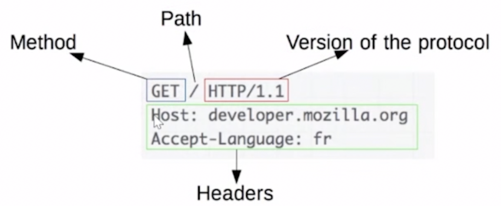

## 2023_07_30 김승희

# HTTP(HyperText Transfer Protocol)

## 1. 개요

- HTTP는 HTML 문서와 같은 리소스들을 가져올 수 있도록 해주는 프로토콜

- HTTP는 웹에서 이루어지는 모든 데이터 교환의 기초이며, **클라이언트-서버 프로토콜**

- HTTP는 TCP/IP 기반으로 되어있다.

- HTTP는 연결 상태를 유지하지 않는 비연결성 프로토콜이다.  

- HTTP는 연결을 유지하지 않는 프로토콜이라**request**(요청)/**response**(응답) 방식으로 동작
  
  - 클라이언트가 HTTP request를 서버에 보내면 서버는 HTTP response를 보내는 구조
  
  

## 2. 구조

- HTTP 요청
  
  * 클라이언트가 서버에게 어떠한 동작을 요청하기 위해 보내는 정보
  
  * ex. 구글 웹페이지로 접속을 하는 요청 - “구글 웹 페이지 띄워줘”
  
  
  
  
* HTTP 응답
  
  

## 3. http와 https의 차이점

- http에 s는 secure. 보안을 의미한다. http 프로토콜을 암호화시킨 버전

## 4. HTTP 기반 시스템의 구성요소

* 각각의 개별적인 요청들은 서버로 보내지며, 서버는 요청을 처리하고 *response*라고 불리는 응답을 제공한다. 이 요청과 응답 사이에는 여러 개체들이 있는데, 예를 들면 다양한 작업을 수행하는 게이트웨이 또는 캐시 역할을 하는 프록시등이 있다.

* 실제로는 브라우저와 요청을 처리하는 서버 사이에는 좀 더 많은 컴퓨터들이 존재한다. (ex. 라우터, 모뎀) 

* 웹의 계층적인 설계로 이들은 네트워크와 전송 계층 내로 숨겨진다. HTTP은 애플리케이션 계층의 최상위에 있다.

* 구성요소
1. 클라이언트 : 사용자 에이전트
   
   - 사용자 에이전트 : 사용자를 대신하여 동작하는 모든 도구 - 주로 브라우저에 의해 실행
   
   - 브라우자는 항상 요청을 보내는 개체

2. 웹 서버
   
   * 통신 채널의 반대편에는 클라이언트에 의한 요청에 대한 문서를 제공하는 서버가 존재
   
   * 서버는 논리적으로는 단일 기계이다
   
   * 그러나 로드(로드 밸런싱) 혹은 그때 그때 다른 컴퓨터(캐시, DB 서버, e-커머스 서버 등과 같은)들의 정보를 얻고 완전하게 혹은 부분적으로 문서를 생성하는 소프트웨어의 복잡한 부분을 공유하는 서버들의 집합일 수도 있다.
   
   * 서버는 반드시 단일 머신일 필요는 없지만, 여러 개의 서버를 동일한 머신 위에서 호스팅 할 수는 있다. 
     
     * HTTP/1.1과 Host 헤더를 이용하여, 동일한 IP 주소를 공유할 수도 있다

3. 프록시
   
   * 웹 브라우저와 서버 사이에서는 수많은 컴퓨터와 머신이 HTTP 메시지를 이어 받고 전달한다. 여러 계층으로 이루어진 웹 스택 구조에서 이러한 컴퓨터/머신들은 대부분은 전송, 네트워크 혹은 물리 계층에서 동작하며, 성능에 상당히 큰 영향을 주지만 HTTP 계층에서는 이들이 어떻게 동작하는지 눈에 보이지 않는다. 이러한 컴퓨터/머신 중에서도 애플리케이션 계층에서 동작하는 것들을 일반적으로 **프록시**라고 부른다.
     
     - 프록시 : 서버와 클라이언트 사이에서 대리러 통신을 수행해주는 것
     
     - 프록시 서버 : 위 기능을 하는 서버
     
     - 사용 목적 / 이유
       
       1. 캐싱
          
          - 프록시 서버 중 일부는 프록시 서버에 요청된 내용을 캐시를 사용해 저장해두는데, 캐시에 저장되어 있는 내용에 대한 재요청은 서버에 따로 접속할 필요가 없이 저장된 내용 그대로 돌려주면 되기 때문에 전송 시간 줄일 수 있고 외부 트래픽을 줄여서 네트워크 병목 현상을 방지할 수 있다.
       
       2. 보안 / 인증
          
          - 프록시 서버가 중간에 경유하게 되면 IP를 숨기는 것이 가능하기 때문에 프록시 서버를 방화벽으로 사용하기도 한다.
       
       3. 접속 우회
       
       4. 필터링 (바이러스 백신 스캔, 유해 컨텐츠 차단)
       
       5. 로드 밸런싱 (여러 서버들이 서로 다른 요청을 처리하도록 허용)
       
       6. 로깅 (이력 정보를 저장)

## HTTP 특징

1. 간단 : 사람이 읽을 수 있으며 간단함

2. 확장 가능 : HTTP헤더를 통해 새로운 기능 추가할 수 있음

3. 상태는 없지만 세션은 있음 (stateless)
   
   - 동일한 연결 상에서 연속하여 전달된 두 개의 요청 사이에는 연결고리가 없다.
   
   - 하지만, HTTP의 핵심은 상태가 없는 것이지만 HTTP 쿠키는 상태가 있는 세션을 만들도록 해준다.
   
   - 헤더 확장성을 사용하여, 동일한 컨텍스트 또는 동일한 상태를 공유하기 위해 각각의 요청들에 세션을 만들도록 HTTP 쿠키가 추가된다.

4. 연결될 수 있도록 하는 전송 프로토콜을 요구하지 않음
   
   * 연결은 전송 계층에서 제어되므로 근본적으로 HTTP 영역 밖
   
   * 다만 그저 신뢰할 수 있거나 메시지 손실이 없는(최소한의 오류는 표시) 연결을 요구할 뿐
   
   * HTTP는 연결이 필수는 아니지만 연결 기반인 TCP 표준에 의존
   
   * 클라이언트와 서버가 HTTP를 요청/응답으로 교환하기 전에 여러 왕복이 필요한 프로세스인 TCP 연결을 설정해야 한다.
     
     * HTTP/1.0 => 각 요청/응답에 대해 별도의 TCP 연결을 연다. 여러 요청을 연속해서 보내는 경우에는 단일 TCP 연결을 공유하는 것보다 효율적이지 않음.
     
     * HTTP/1.1 =>파이프라이닝 개념과 지속적인 연결의 개념을 도입
     
     * HTTP/2 => 연결을 좀 더 지속되고 효율적으로 유지하는데 도움이 되도록, 단일 연결 상에서 메시지를 다중 전송(multiplex)
   
   ## HTTP의 기능
   
   1. 캐시
      
      * HTTP로 문서가 캐시되는 방식을 제어할 수 있다.
      
      * 서버는 캐시 대상과 기간을 프록시와 클라이언트에 지시할 수 있고 클라이언트는 저장된 문서를 무시하라고 중간 캐시 프록시에게 지시할 수 있다.
   
   2. origin 제약사항 완화하기
      
      * 스누핑과 다른 프라이버시 침해를 막기 위해, 브라우저는 웹 사이트 간의 엄격한 분리를 강제하기 때문에 **동일한 origin**으로부터 온 페이지만이 웹 페이지의 전체 정보에 접근할 수 있다
      
      * 위와 같은 제약 사항은 서버에 부담이 되지만 HTTP 헤더를 통해 그것을 완화시킬 수 있다.
   
   3. 인증
      
      * 기본 인증은 HTTP를 통해 [`WWW-Authenticate` (en-US)](https://developer.mozilla.org/en-US/docs/Web/HTTP/Headers/WWW-Authenticate "Currently only available in English (US)") 또는 유사한 헤더를 사용해 제공되거나, HTTP 쿠키를 사용해 특정 세션을 설정하여 이루어질 수도 있다.
   
   4. 프록시와 터널링
      
      * 서버 혹은 클라이언트 혹은 그 둘 모두는 종종 인트라넷에 위치하며 다른 개체들에게 그들의 실제 주소를 숨기기도 한다. HTTP 요청은 네트워크 장벽을 가로지르기 위해 프록시를 통해 나가게 된다.
      
      * *주의* : 모든 프록시가 HTTP 프록시는 아님
   
   5. 세션
      
      * HTTP가 기본적으로 상태없는 프로토콜임에도 세션을 만들어줌을 통해 쿠키 사용은 서버 상태를 요청과 연결하도록 해준다.
   
   ## HTTP 흐름
   
   1. TCP 연결을 연다
   
   2. HTTP 메시지를 request
   
   3. 서버에 의해 전송된 response를 읽는다
   
   4. 연결을 닫거나 다른 요청들을 위해 재사용된다

출처 : https://developer.mozilla.org/ko/docs/Web/HTTP/Overview\

안녕
