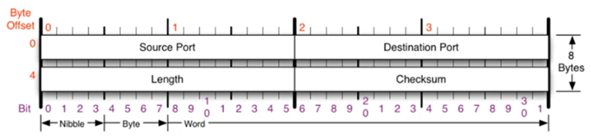
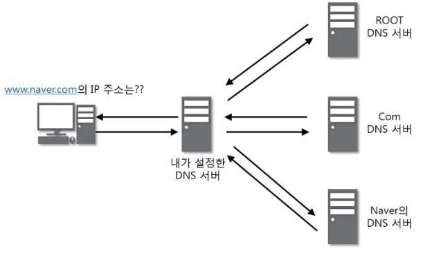
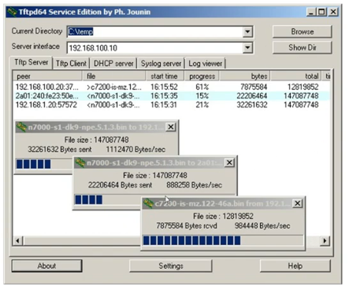

## 1. UDP 프로토콜
1. UDP가 하는 일
    - 전송 방식이 단순함
    - 신뢰성이 낮음
    - 일반적으로 오류의 검사와 수정이 필요 없는 프로그램에서 수행
2. UDP 프로토콜의 구조 
        <figure>
        
        </figure>
    - 포트번호만 존재함.

## 2. UDP 프로토콜을 사용하는 프로그램
1. UDP 프로토콜을 사용하는 대표적인 프로그램들
    - DNS 
        <figure>
        
        </figure>
    - Tftp 
        <figure>
        
        </figure>
    - RIP 프로토콜 
        <figure>
        
        </figure>
