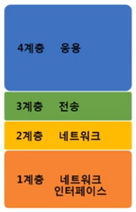
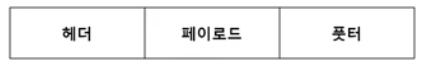
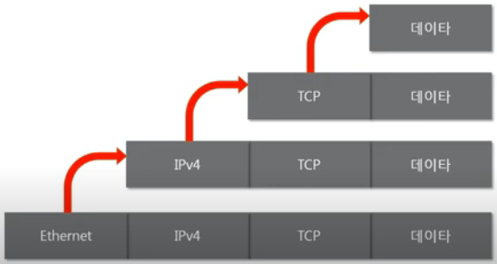

## 1. 네트워크 모델의 종류
1. TCP/IP 모델
    - 정의: 현재의 인터넷에서 컴퓨터들이 주고받는데 쓰이는 통신 프로토콜의 모음 (실질적인 분류)
    - 역사: 1960년대 말 미국방성의 연구에서 시작되어 1980년 초 프로토콜 모델로 공개. 
    <figure>
    
    </figure>
2. OSI 7계층
    - 정의: 데이터를 주고받을 때 데이터 자체의 흐름을 각 구간별로 나눠놓은 것 (이론적인 분류)
    - 역사: 1984년 ISO에서 표준으로 지정한 모델 
    <figure>
    
    </figure>

## 2. OSI 7계층 vs. TCP/IP 4계층
1. 공통점
    - 계층적 네트워크 모델
    - 계층간 역할 정의  
2. 차이점
    - 계층의 수 차이
    - OSI는 역할 기반, TCP/IP는 프로토콜 기반
    - OSI는 통신 전반에 대한 표준
    - TCP/IP는 데이터 전송기술 특화

## 3. 패킷
### 패킷이란?
- **네트워크 상에서 전달되는 데이터**를 통칭하는 말로, 네트워크에서 전달하는 데이터의 형식화된 블록이다. 
    <figure>
    
    </figure>
- 패킷은 **제어정보**와 **사용자 데이터**로 이뤄지며, 사용자 데이터는 **페이로드**라고 한다
- 패킷의 형태는 따로 정해져있지 않고 계속 추가될 수 있다.
- 풋터는 잘 사용하지 않는다.  
### 캡슐화
- 여러 프로토콜을 이용해서 최종적으로 **보낼 때** 패킷을 만드는 과정 
    <figure>
    
    </figure>
### 디캡슐화
- 패킷을 **받았을 때** 프로토콜들을 하나씩 확인하면서 데이터를 확인하는 과정 
    <figure>
    
    </figure>
### 계층별 패킷의 이름 PDU(Protocol Data Unit)
- 각 계층에서 패킷을 부르는 용어가 다르다 
    <figure>
    
    </figure>
- 일반적으로 네트워크 상의 데이터를 패킷이라고 부르기도 한다.
- 세그먼트, 스트림(총 데이터)에 비해 프레임이라는 단어는 종종 사용된다.
