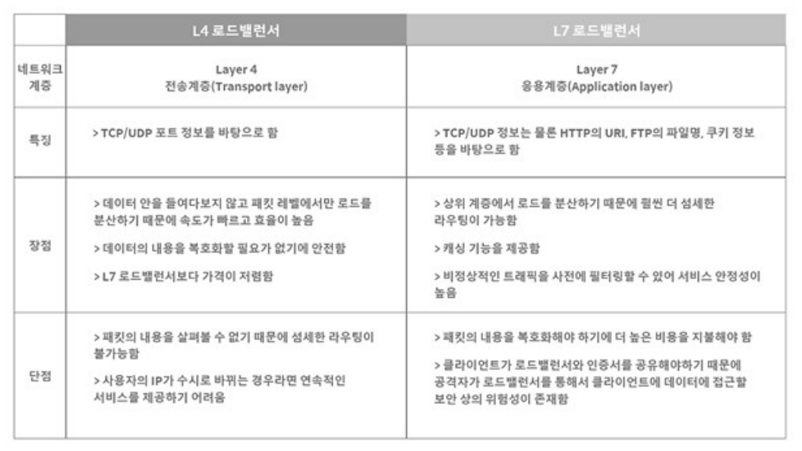

## 1. 애플리케이션 계층 – L7 스위치
- L7 스위치 (로드 밸런서):
    - URL , 서버 , 캐시 , 쿠키들을 기반으로 트래픽을 분산한다
    - 서버의 부하를 분산하는 기기로 시스템이 처리 할 수 있는 트래픽 (서버와 스위치 등 네트워크 장치에서 일정 시간 내에 흐르는 데이터의 양)증가를 목표로 한다.
1. 바이러스, 불필요한 외부 데이터 등을 걸러내는 필터링 기능
2. 응용 프로그램 (사용자를 위해 특정 기능을 직접 수행하는 포괄적이고 독립적 인 프로그램) 수준의 트래픽 모니터링도 가능

## 2. 헬스 체크
### 헬스 체크란?
- L4 스위치 또는 L7 스위치 모두 헬스 체크를 통해정상적인 서버 또는 비정상적인 서버를 판별하는데 헬스 체크는 전송 주기와 재전송 횟수 등을 설정한 이후 반복 적으로 서버에 요청을 보내는 것을 의미한다.
- 장애 발생 시, 트래픽 분산 대상에서 제외하기 위해 정기적으로헬스 체크(health check)를 이용하여 감시하며 이루어짐

### L4 체크
- TCP의 3-way handshaking을 통해 각 서버의 포트 상태를 확인한다.

### L7 체크
- 애플리케이션 계층에서 체크하는 방법으로 실제 웹 페이지에 통신을 시도해 이상 유무를 파악한다.

## 3. L4 스위치와 L7 스위치 차이
- L4 스위치:
    - IP와 포트를 기반으로 트래픽을 분산한다.
    - 전송 계층을 처리하는 기기로 스트리밍 관련 서비스에서는 사용할 수 없고 메시지를 기반으로 인식하지 못한다.
- L7 스위치:
    - IP, 포트, HTTP 헤더, 쿠키 등을 기반으로 트래픽을 분산한다. 
        <figure>
        
        </figure>

## 4. 서버 이중화
- 이중화 : 시스템의 가용성을 높이기 위해 장비를 다중화 시키는방법
- 가용성 : (정상 서비스 시간)/(총 서비스 시간) = 가용성--> 서비스가 다운 되지 않고 유지된 시간
- 2 대 이상의 서버를 기반으로 가상 IP를 제공하고 이를 기반으로 안정적인 서비스를 제공함

### 과정
1. 이중화된 로드 밸런서들은 서로 상태 확인을 한다.
2. Master 서버가 Fail되면 Standby 서버가 자동으로Master 서버의 역할을 한다. 
3. Standby 서버는 평상 시에는 대기 상태로 있다가Master 서버가 Fail 되었을 경우에만 작동한다. 
4. 이 구성을 Fail Over라고 한다. 
    <figure>
    
    </figure>
    