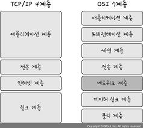
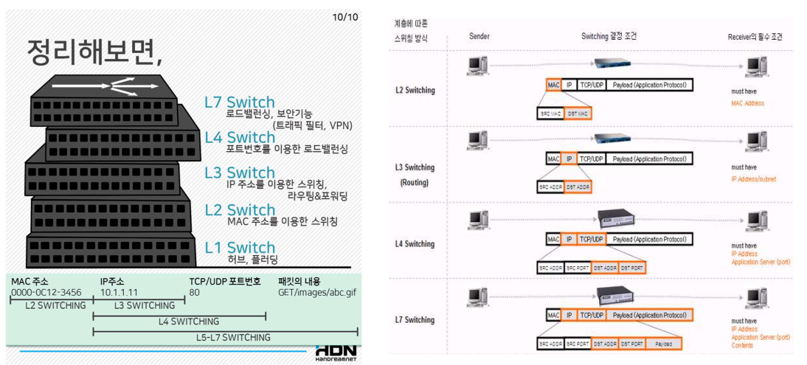

## 1. 네트워크 기기
- 계층 별로 처리 범위를 나눌 수 있음
    - 애플리케이션계층: L7 스위치
    - 인터넷계층: 라우터, L3 스위치
    - 데이터링크계층: 브리지, L2 스위치
    - 물리계층: NIC, 리피터, AP 
        <figure>
        
        </figure>
- 상위 계층을 처리하는 기기는 하위 계층을 처리 할 수 있지만, 그 반대는 불가함 
    <figure>
    
    </figure>

## 2. 기본 용어
- 스위치
    - 여러 장비를 연결하고, 데이터 통신을 중재하며 목적지가 연결된 포트로만 전기 신호를 보내 데이터를 전송하는 네트워크 장비.
    - 데이터 링크 계층(계층 2)에서 작동하며, 물리적 포트에 연결된 기기에서 전송된 패킷을 받아 다시 내보내는 역할을 한다. 패킷이 도달해야 하는 기기로 이어지는 포트를 통해서만 패킷을 보내게 된다.
    - 3계층 통신기기의 도움 없이는 내부네트워크 간의 통신만이 가능하다는 한계가 있다.
- 라우터
    - IP 주소를 기반으로 서로 다른 네트워크를 연결하는 기능을 하는 네트워크 장비
    - 네트워크 계층(계층 3)에서 작동하며, 내부와 외부 네트워크 신호를 구분할 수 있어서 외부 네트워크와 통신이 가능하다.
    - 스위치에 비해 굉장히 비싸다. 
        <figure>
        
        </figure>
- 로드밸런싱
    - 여러 서버들로 대규모의 네트워크 트래픽을 분산 처리하는 기술
    - 수천만 명의 접속자를 감당하기 위해 서비스를 제공하는 측에서 미리 트래픽을 예측하고서버와 네트워크를 증설하는데, 이때 한 서버의 성능을 높이는 scale-up 작업은 한계가있으므로, 분산처리를 위해 여러 대의 서버들을 놓게 되는 scale-out 작업을 하게 되는데, 이 때 로드밸런싱이 필요하다. 
        <figure>
        
        </figure>

## 3. 네트워크 기기의 분류
- L1 스위치
    - 가장 하위 계층 (물리 계층)
    - NIC, 리피터, AP
- L2 스위치
    - 데이터 링크 계층 , MAC 주소를 읽은 후 해당 장비를 찾아 전달 해 주는 장비
    - L2, 브릿지
- L3 스위치 (+라우팅 기능)
    - MAC + IP 주소
    - 라우터 : 네트워크 패킷을 연결해주는 통로 역할 (대역폭 확장)
    - L3, 라우터
- L4 스위치 , L7 스위치 (로드밸런서)
    - IP + 포트 정보 + etc...
    - L4, L7
