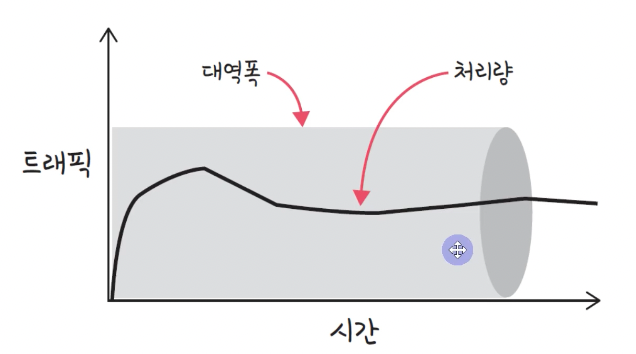

## 1. 네트워크란 무엇인가?
1. 네트워크란?
    - **노드**들이 데이터를 공유할 수 있게 하는 디지털 전기**통신망**의 하나이다. 즉, 분산되어 있는 컴퓨터를 통신망으로 연결한 것을 말한다.
    - 네트워크에서 여러 장치들은 노드 간 연결을 사용하여 서로에게 데이터를 교환한다.  
    - 네트워크 구성요소 : ① 컴퓨터, ② 전송 매체, ③ 네트워크 장비 
        <figure>
        
        </figure>
2. 네트워크의 목적
    - 컴퓨터로부터 다른 컴퓨터로 데이터를 전송하는 것
    - 계층별 요구 사항
       - 전송 계층 : **신뢰성** 있는 전송 서비스의 제공
       - 네트워크 계층 : 네트워크 노드 간의 **라우팅 서비스**의 제공
       - 데이터 링크 계층 : **물리적으로 연결된** 노드에게 데이터 전송 서비스 제공
       - 물리 계층 : 실제 **비트 신호**를 전송하는 서비스 제공
3. 인터넷이란?
    - 문서, 그림 영상과 같은 여러가지 데이터를 공유하도록 구성된 **세상에서 가장 큰 전세계를 연결하는 네트워크**. 
   -  흔히 www를 인터넷으로 착각하는 경우가 많은데 www는 인터넷을 통해 웹과 관련된 데이터를 공유하는 것

## 2. 네트워크 용어
### 2-1. 기본 용어
- 노드 : 네트워크에 속한 컴퓨터 혹은 통신장비를 이르는 말(서버, 라우터, 스위치 등)
- 링크 : 유선 또는 무선을 의미 
    <figure>
    
    </figure>
- 호스트 : 고유 **IP 주소**를 가진 노드. 즉, 인터넷에 연결된 컴퓨터라고 볼 수 있다.
- 홉(Hop) : 거리의 단위. 보통 한 링크를 이동하면 한 홉이라고 한다.
- 경로(Path) : 네트워크상의 두 노드 간 이동 경로
- 프로토콜 : 데이터 통신을 원활하게 하기 위해 필요한 통신 규약

### 2-2. 처리량과 지연시간
#### 좋은 네트워크란?
- 많은 처리량을 처리할 수 있으며 지연시간이 짧고 장애빈도가 적으며 좋은 보안을 갖춘 네트워크  
#### 처리량(throughput)
- **처리량** : 링크 내 성공적으로 전달 된 데이터의 양을 말하며 보통 얼만큼의 트래픽을 처리했는지를 나타냄
- **단위** : bps(bits per second), 초당 전송 또는 수신되는 비트 수  
    <figure>
    
- 처리량은 사용자들이 많이 접속할 때마다 커지는 트래픽, 네트워크 장치 간의 대역폭, 네트워크 중간에 발생하는 에러, 장치의 하드웨어 스펙에 영향을 받는다 
        
        트래픽이 많아졌다 = 흐르는 데이터가 많아졌다
        처리량이 많아졌다 = 처리되는 트래픽이 많아졌다

- 대역폭 : 주어진 시간 동안 네트워크 연결을 통해 흐를 수 있는 최대 비트 수  
#### 지연시간(latency)
- **지연시간** : 요청이 처리되는 시간을 말하며 어떤 메시지가 두 장치 사이를 왕복하는데 걸린 시간 
    <figure>
    
- 지연시간은 매체 타입(무선, 유선), 패킷 크기, 라우터의 패킷 처리 시간에 영향을 받는다

### 2-3. 네트워크 통신 방식
- 유니 캐스트 : 특정 대상이랑만 1:1로 통신 
    <figure>
    
    </figure>
- 멀티 캐스트 : 특정 다수와 1:N 으로 통신 
    <figure>
    
    </figure>
- 브로드 캐스트 : 네트워크에 있는 모든 대상과 통신 
    <figure>
    
    </figure>