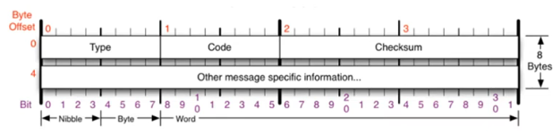
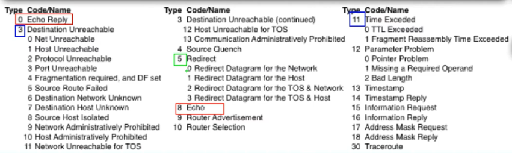
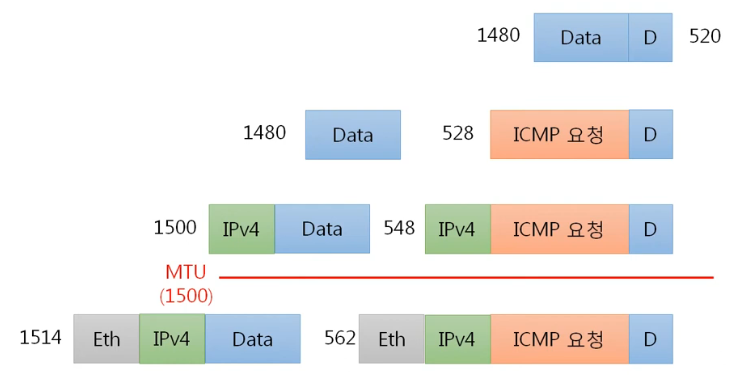

##### [돌아가기](./README.md)
# 6. 3계층 (IPv4, ICMP)

## 6-1. IPv4 프로토콜
1. IPv4가 하는 일
    - 네트워크 상에서 데이터를 교환하기 위한 프로토콜
    - 데이터가 **정확하게 전달될 것을 보장하지 않는다.**
2. IPv4 프로토콜의 구조 
        <figure>
        
        </figure>
    - Version (0.5): 4버젼이므로 (04)가 온다.
    - IHL (0.5): IP 헤더의 길이/4 (5~15)
    - TOS (1): 지금은 쓰이지 않아 (0) 으로 비워둔다
    - Total Length (2): 페이로드를 포함한 전체 길이
    - Identification (2): 원래 하나였던 데이터 패킷에 부여하는 식별자로, 다시 합칠 때 사용
    - IP Flags (3/8): x D M 의 3비트로 이루어져있으며, x는 사용하지 않는 자리이다.
        - D (Dont Fragmentation): 쪼개지 않겠다는 의미. 그러나 최소 전송단위를 넘으면 전송이 되지 않는다.
        - M (More Fragmentation): 조각이 더 있다는 의미. 마지막 데이터를 제외하면 모두 1을 가진다.
    - Fragment Offset (5/8): 데이터 조각이 시작부분으로부터 얼마나 떨어져 있는지 표시.
    - TTL (1): 패킷이 살아남을 수 있는 홉의 수. 운영체제마다 다르다. 윈도우 (128), 리눅스 (64)
    - Protocol (1): 상위 프로토콜에 대한 정보. ICMP (01), TCP (06), UDP (17)
    - Header Checksum (2): 헤더의 오류를 검사하는 코드. 계산해 볼 필요 X
    - Source/Destination Address (4, 4): 출발지와 목적지의 IP 주소.
    - IP Option (4~40): 추가 옵션을 작성하는 부분. 잘 안씀.

## 6-2. ICMP 프로토콜
1. ICMP(인터넷 제어 메세지 프로토콜)가 하는 일
    - 네트워크 컴퓨터 위에서 돌아가는 운영체제에서 **오류 메세지**를 전송받는 데 주로 쓰인다.
2. ICMP 프로토콜의 구조 
        <figure>
        
        </figure>
    - Type, Code (1, 1): 오류 메세지의 대분류와 소분류
    - Checksum (2): 헤더 오류 검사용 코드
    - Others
3. Type, Code 
        <figure>
        
        </figure>
    - 0, 8 : 응답, 요청
    - 3 : 경로상 요청 문제 (라우터 문제 등)
    - 11 : 상대방 문제 (방화벽 등)
    - 5 : 라우팅 테이블 원격 수정 (보안)

## 6-3. 라우팅 테이블
1. 내가 보낸 패킷은 어디로 가는가
    - 다른 네트워크로 갈 때 어디로 보내야 하는지 설정되어 있음
    - 지도에 없을 경우 기본값으로 0.0.0.0, 게이트웨이로 보냄 
        <figure>
        
        </figure>

## 6-4. 다른 네트워크와 통신 과정
1. 요청
    1. ICMP 작성 : 요청(08)
    2. IPv4 작성 : ...
    3. Ethernet 작성 : 목적지 MAC을 LAN의 라우터로 작성
2. 전송
    1. 라우터가 2계층 확인 후 재작성
    2. 반복하여 상대 라우터까지 도달
    3. 상대 라우터가 3계층 확인 후 MAC 주소 작성 및 전달
3. 응답
    1. ...(요청과 유사) 
        <figure>
        
        </figure>

## 6-5. IPv4의 조각화
1. 조각화란?
    - 큰 IP 패킷들이 작은 MTU(Maximum Transmission Unit)를 갖는 링크를 통하여 전송되려면 **여러 개의 작은 패킷으로 쪼개어/조각화 되어 전송**돼야 한다.
    - 보통 1500바이트
    - 2번 이상 조각화 되기도 한다.
2. 큰 데이터를 전송하는 패킷이 조각화하는 과정
    1. 데이터를 IPv4의 크기(20)를 고려하여 조각화 (1480)
    2. IPv4 프로토콜 (20)로 캡슐화한 후 MTU 통과. (1500)
    3. MTU를 통과한 이후 이더넷(14) 프로토콜로 캡슐화하여 전송 (1514) 
        <figure>
        
        </figure>

 

<figure>

</figure>s