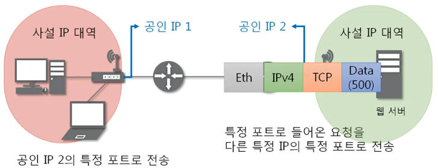
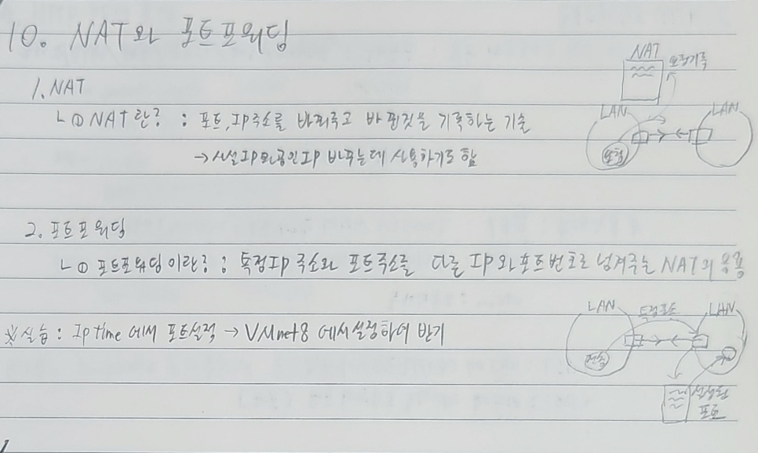

##### [돌아가기](./README.md)
# 10. NAT와 포트포워딩

## 10-1. NAT
1. NAT란?
    - IP 패킷의 TCP/UDP 포트 숫자와 소스 및 목적지의 IP 주소 등을 재기록하면서 라우터를 통해 네트워크 트래픽을 주고 받는 기술을 말한다.
    - 바뀐 정보를 기록하는 기술
    - 사설IP 와 공인IP 
        <figure>
        
        </figure>

## 10-2. 포트포워딩
1. 포트포워딩이란?
    - 패킷이 라우터나 방화벽같은 네트워크 장비를 지나는 동안 **특정 IP주소와 포트 번호의 통신 요청을 특정 다른 IP와 포트 번호로 넘겨주는** 네트워크 주소 변환(NAT)의 응용이다. 
        <figure>
        
        </figure>

 

<figure>

</figure>