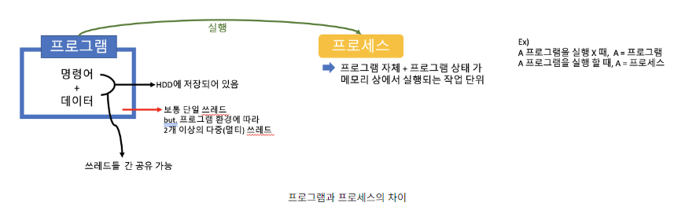
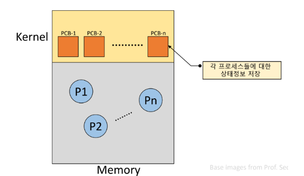
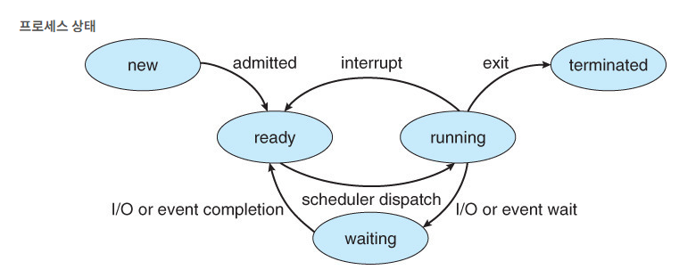
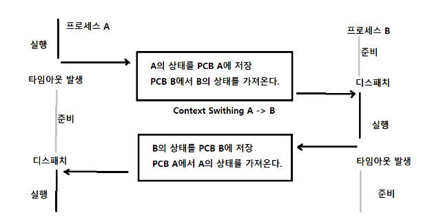
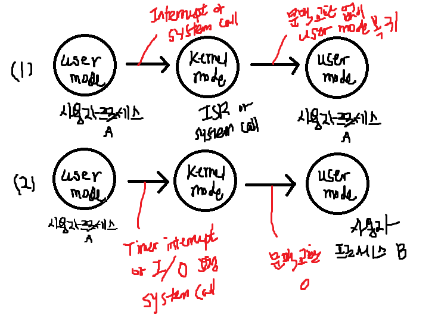

## 프로세스의 개념
#### 키워드 정리


- 프로세서 (Processor) : CPU
- 프로그램 : 컴파일 코드, 전역변수, 문자열, 문자열 상수 등의 정적 데이터를 가진 정적인 객체
- 프로세스 (Process) : 실행 중인 상태의 프로그램 (동적인 객체)
- 테스크 (Task) : { 레지스터, 스택, 포인터, 실행중인 프로그램, 데이터 }

- 프로세서는 한번에 1개의 프로세스만 관리 할 수 있기 때문에 순차적으로 다른 프로세스로 넘어갈 떄 이전에 관리하고 있던 프로세스에 대한 정보를 저장해놓는다.
- 이 때 저장하는 공간을 PCB라고 한다


- 쓰레드 : 프로그램 내부에서 실행되는 흐름의 단위
- 보통의 경우 : 1개의 프로세스 내부에 1개의 단일 쓰레드가 존재, BUT
- 다중 쓰레드 : 2개이상의 다중 쓰레드 존재


### 프로세스의 특성 
    1. 자원 소유의 단위
    2. 디스패칭의 단위


### 프로세스 문맥 (context) : 
    
- CPU 수행 상태를 나타내는 하드웨어 문맥
    - Program Counter
    - 각종 register
- 프로세스의 주소 공간
    - code, data, stack, heap
        - DATA : 전역 변수와 static 변수가 할당되는 영역, 프로그램의 시작과 동시에 할당되고, 프로그램이 종료돼야 메모리에서 소멸된다.
        - STACK : 함수 호출 시 생성되는 지역 변수, 매개 변수, 복귀 주소와 같은 임시 자료들을 가진다. 함수 호출이 완료되면 사라진다.<잠시 사용되었다가 사라지는 데이터가 저장>
        - CODE : 실행할 프로그램의 코드가 저장됨. CPU는 여기서 명령어를 하나씩 가져와서 처리함
        - HEAP : 프로세스 실행 중에 동적으로 할당되는 메모리 -> 메모리 주소 값에 의해서만 참조되고, 사용됨 . 프로그램 동작 시 크기가 결정됨
- 프로세스 관련 커널 자료 구조
    - PCB (Process Control Block)
        ```
        운영체제가 각 프로세스를 관리하기 위해 프로세스 당 유지하는 정보이며, 다음과 같은 구성 요소를 가진다.

        - OS가 관리상 사용하는 정보 : Process state, Process ID, scheduling information, priority
        - CPU 수행 관련 하드웨어 값 : Program Counter, registers
        - 메모리 관련 : Code, Data, Stack의 위치 정보
        - 파일 관련
        ```
    - Kernel Stack


***

참고
### PCB 의 구조



- 포인터 (Pointer) : 현재 프로세스가 위치한 주소
- 프로세스 상태 : 보류, 준비, 실행, 대기, 정지 등 프로세스의 상태
- 프로세스 식별자 : 프로세스를 구별하기 위해 부여된 고유번호로 정수값으로 나타냄
- 프로그램 카운터 : 다음에 실행할 명령어에 대한 주기억장치상의 주소
- 프로세스 우선순위 및 스케줄링 정보 : 프로세스 스케줄링 시 실행될 우선순위 등 스케줄링에 관한 정보
- 각종 CPU 레지스터 정보 : 누산기(Accumulator), Index Register, 범용 레지스터, 스택 레지스터, 기타 상태 코드
- 기억장치 관리 정보 :  해당 프로세스가 주기억 장치의 어느 영역에 위치해 있는지를 저장
- 할당된 자원(입출력 상태 등) 정보 :  계정 번호, CPU 실제 사용시간( 할당 시간 ), 한정된 시간 등
- 부모 PID와 자식 PID : 부모 프로세스에 대한 포인터, 자식 프로세스에 대한 포인터 

***


### 프로세스 상태:


- Running <준비 상태> : CPU를 잡고 instruction을 수행 중인 상태
    - 준비 상태 큐에 있는 프로세스가 프로세서를 할당받아 실행 되는 상태 : Dispatch
    - 프로세스가 완료되긴 전 주어진 프로세서 할당 시간이 종료 하면 프로세스는 다시 준비상태로 이동
    - 실행 중인 프로세스가 입출력(I/O) 처리가 발생하면 대기상태(Waiting)로 이동
    - 프로세스는 보통 타임 슬라이스 동안 처리기를 할당받으며, 프로세스 사이의 문맥교환이 발생
- Ready <실행 상태> : CPU를 기다리는 상태 ( 메모리 등 다른 조건 만족 )
- Blocked ( Wait, Sleep ) : 
    - CPU 를 주어도 instruction 수행하지 못함
    - Process 자신이 요청한 event가 즉시 만족되지 못함
    - ex ) 디스크에서 파일을 읽어와야하는 경우
- New <생성 상태> : 프로세스가 생성 중
- Terminated <완료 상태> : 수행이 끝난 상태

### Context switch (문맥 교환)

#### 문맥 교환이란,
- 인터럽트를 발생 시켜서 CPU에서 실행중인 프로세스를 중단하고, 다른 프로세스를 처리하기 위한 과정이다.
- 현재 실행 중인 프로세스의 상태를 먼저 저장하고, 다음 프로세스를 동작 시켜 작업을 처리한 후에 이전에 저장된 프로세스의 상태를 복구한다.



- CPU를 한 프로세스에서 다른 프로세스로 넘겨주는 과정을 의미함
- CPU가 다른 프로세스에게 넘어갈 때 운영체제는 다음과 같은 과정을 수행 
    1. CPU를 내어주는 프로세스의 상태를 그 프로세스의 PCB에 저장한다.
    2. CPU를 새롭게 얻는 프로세스의 상태를 PCB에서 읽어온다

< SYSTEM CALL이나 INTERRUPT 발생시 반드시 문맥 교환이 일어나는 것은 아님>



     (1) : 문맥교환 발생 X
     (2) : 문맥 교환이 발생 하는 경우
     (1)도  CPU 수행 정보 등 Context의 일부를 PCB에 저장, 하지만 문맥교환 하는 (2)의 경우 부담이 훨씬 크다 (OVERHEAD)

#### 프로세스를 스케줄링 하기 위한 QUEUE


- Job Queue : 현재 시스템 내에 있는 모든 프로세스의 집합
- Ready Queue : 현재 메모리 내에 있으면서 CPU를 잡아서 실행 되기를 기다리는 프로세스의 집합
- Device Queue : I/O Device의 처리를 기다리는 프로세스의 집합

#### Scheduler

- Long-term scheduler (job scheduler)
    - 시작 프로세스 중 어떤 것들을 ready queue로 보낼지 결정한다
    - 프로세스에 memory 및 각종 자원을 주는 문제를 다룬다
    - degree of Multiprogramming 을 제어한다.
    - time sharing system에는 보통 장기 스케줄러가 없다 (무조건 ready 임)
- Short-term scheduler (CPU sceduler)
    - 어떤 프로세스를 다음번에 running 시킬 지 결정한다.
    - 프로세스에 CPU를 주는 문제를 다룬다
    - 충분히 빨라야 한다.
- Meduium-term scheduler (Swapper)
    - 여유 공간을 마련하기 위해 프로세스를 통째로 메모리에서 디스크로 쫓아낸다.
    - 프로세스에게서 memory를 뺏는 문제를 다룬다
    - degree of Multiprogramming을 제어한다.

#### 프로세스의 상태

- Suspended (Stopped):
    - 외부적인 이유로 프로세스의 수행이 정지된 상태. 프로세스는 통째로 디스크에 swap out 된다.

#### 프로세스 상태 전이

- Dispatch :
    - 준비 상태 -> 실행 상태
- Time Runout : 
    - 실행 상태 -> 준비 상태
- Block : 
    - 실행 상태 -> 대기 상태
- Wake-Up : 
    - 대기 상태 -> 준비 상태

