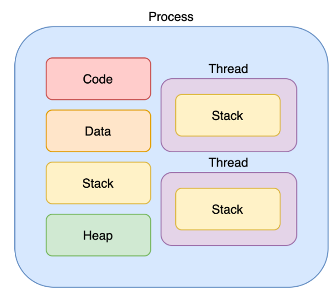
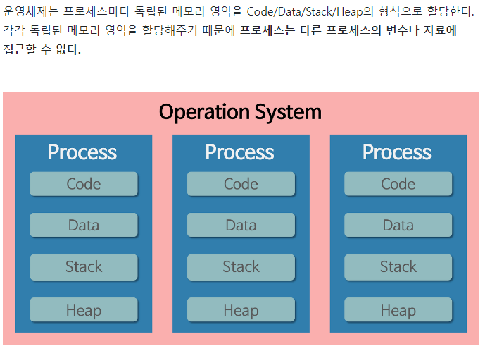

## 스레드의 개념

#### 정의:

#### - 프로세스 내에서 할당받은 자원을 이용해 동작하는 실행 단위

- 프로세스 하나만을 이용해서 프로그램을 실행 하기에는 메모리의 낭비가 발생한다.
- 스레드는 프로세스와 다르게 스레드 간 메모리를 공유하며 작동한다.




#### Thread 가 독립적으로 가지고 있는 부분

- PROGRAM COUNTER (-> 실행 흐름)
- REGISTER SET
- STACK SPACE

#### Thread 가 동료 Tread와 공유하는 부분 (Task)

- CODE SECTION
- DATA SECTION
- OS RESOURCES


#### 특징 :
- 스레드는 프로세스 내에서 STACK만 따로 할당 받고, CODE/DATA/HEAP 영역은 공유한다.
- STACK에는 함수의 호출 정보가 저장되는데, 스택을 공유하게 되면, LIFO 구조에 의해 실행 순서가 복잡해져서 STACK만 따로 분리
- STACK을 분리한다는 의미는 독립적인 함수 호출이 가능하다는 것으로 독립적인 실행 흐름이 추가되기 때문에 스레드의 정의에 따라 독립적인 실행을 추가하기 위한 최소조건으로 독립된 스택을 할당한다.



## 왜 쓰레드를 사용할까 ?

- 여러 개의 프로세스를 순차적으로 실행하는 멀티 태스킹 사용 할 경우

- 예 ) A, B라는 프로세스 2개가 서로 동일한 데이터를 요구할 때, 멀티 태스킹은 A, B 프로세스를 위한 데이터 똑같은 것을 OS가 2개씩 할당하게 된다.
    - 동일한 데이터를 요구한다면 1번만 할당 받아서 A,B 프로세스가 동일한 데이터 1개를 공유하면 되지 않을까?


#### 스레드를 사용했을 때의 장점 정리

- 다중 스레드로 구성된 테스크 구조에서는 하나의 서버 스레드가 BLOCKED(WAITING) 상태인 동안에도 동일한 태스크 내의 다른 스레드가 실행(running) 되어 빠른 처리를 할 수 있다.

- 동일한 일을 수행하는 다중 스레드가 협력하여 높은 처리율 (throughput) 과 성능 향상을 얻을 수 있다.

- 스레드를 사용하면 병렬성을 높일 수 있다.

## 멀티태스킹, 멀티스레드

1. 멀티 태스킹 : 하나의 운영체제 안에서 여러 프로세스가 실행되는 것을 의미한다.
2. 멀티 스레드 : 하나의 프로세스가 여러 작업을 여러 스레드를 사용해 동시에 처리하는 것을 의미한다.

#### 멀티스레드의 장단점
- 장점:
    - 1. CONTEXT-SWITCHING 할 때 공유하고 있는 메모리만큼 메모리 자원을 아낄 수 있다.
    - 2. 스레드는 프로세스 내의 STACK 영역을 제외한 모든 메모리를 공유하기 때문에 통신 부담이 적어서 응답시간이 빠르다

- 단점:
    - 1. 스레드 하나가 프로세스 내의 자원을 망쳐버린다면, 모든 프로세스가 종료 될 수 있다.
    - 2. 자원을 공유하기 때문에 필연적으로 동기화 문제가 발생 -> 교착상태가 발생하지 않도록 주의
        - 동기화 문제 (SYNCHRONIZATION ISSUE)
            ```
            멀티 스레드를 사용하면, 각각의 스레드 중 어떤 것이 어떤 순서로 실행될 지 그 순서를 알 수가 없다. 만약 A 스레드가 어떤 자원을 사용하다가 B 스레드로 제어권이 넘어간 후 B 스레드가 해당 자원을 수정했을 때, 다시 제어권을 받은 A가 해당 자원에 접근하지 못하거나, 바뀐 자원에 접근하게 되는 오류가 발생 할 수 있다.

            이처럼 여러 스레드가 함께 전역 변수를 사용할 경우 발생할 수 있는 충돌을 동기화 문제라고 한다.
            ```

### 프로세스끼리 정보 공유 하는 방법

1. IPC(Inter-Process Communication) 사용
2. LPC(Local-Process Communication) 사용
3. 별도로 공유 메모리를 만들어서 정보를 주고 받도록 설정

- 단순히 CPU 레지스터 교체 뿐 아니라 RAM과 CPU 사이의 캐시 메모리까지 초기화 되기 때문에 자원 부담이 크다

#### IPC (Inter-Process Communication)

- 각 프로세스들은 별도의 공간에서 실행 되기 때문에 한 프로세스에서 다른 프로세스의 메모리 영역에 접근 할 수 없다.
- 다른 프로세스에 접근하기 위해 IPC를 사용하는데 이에는 크게 두가지 모델이 있다
    - Message Passing 모델
    - Shared Memory 모델


1. MESSAGE PASSING : 
    - 메시지를 전달하기 위해 커널을 들림. 이 과정에서 USER LEVEL 과 KERNEL LEVELD을 넘나들게 되고 , 매번 SYSTEM CALL 이 호출되어 이에 따른 오버헤드가 발생

2. SHARED MEMORY : 
    - 프로세스 사이에 공유 공간이 존재하기 때문에 시스템 호출이 필요하지 않음. 이로 인해 커널 의존성도 낮고 속도도 빠르다. 하지만 공유공간에 대한 제한이 존재한다.