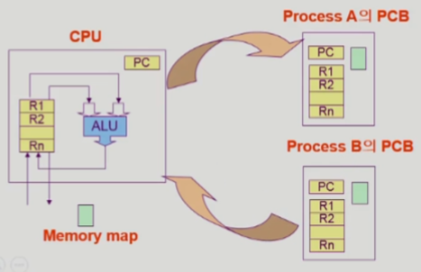
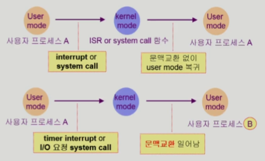
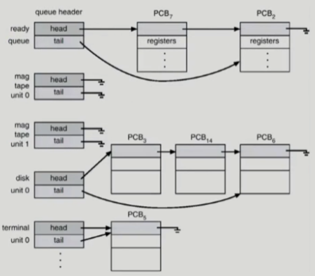
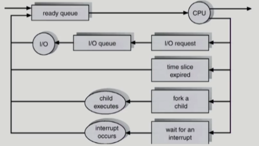
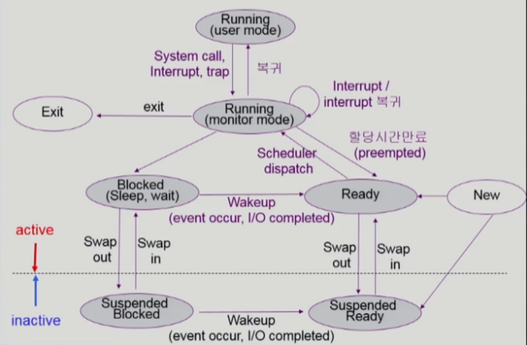
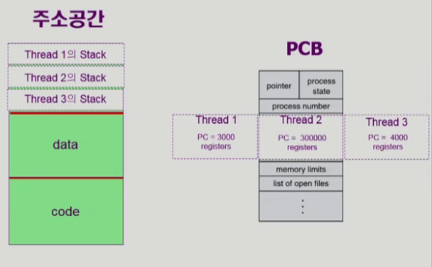
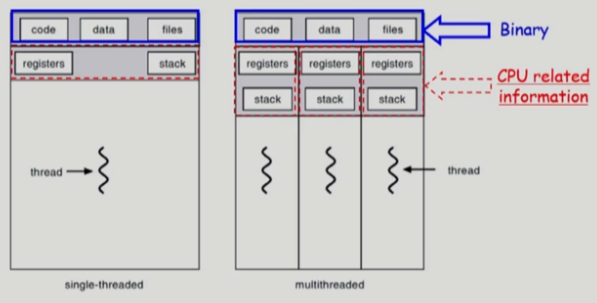
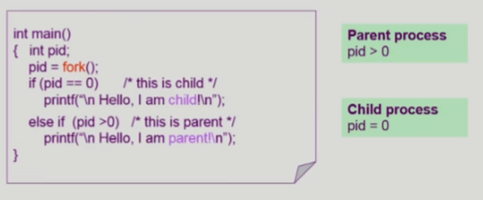
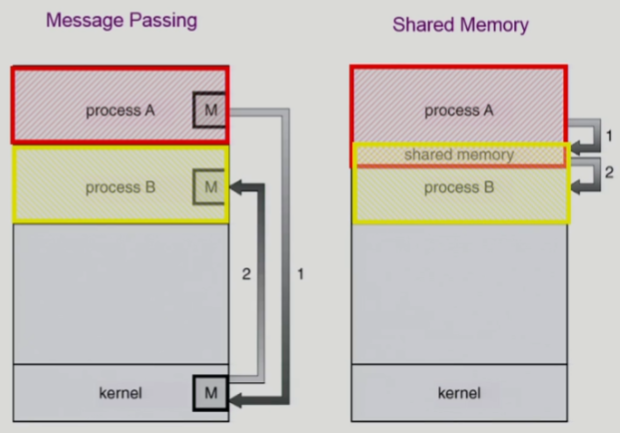

## 목차
- [1. 프로세스의 개념](#1-프로세스의-개념)
  - [1-1. 프로세스의 문맥](#1-1-프로세스의-문맥)
- [2. 프로세스의 상태](#2-프로세스의-상태)
  - [2-1. PCB](#2-1-pcb)
- [3. 문맥 교환](#3-문맥-교환)
  - [3-1. 프로세스를 스케줄링하기 위한 큐](#3-1-프로세스를-스케줄링하기-위한-큐)
  - [3-2. 스케줄러](#3-2-스케줄러)
  - [3-3. 프로세스의 상태:Re](#3-3-프로세스의-상태re)
- [4. 스레드](#4-스레드)
  - [4-1. 스레드의 장점](#4-1-스레드의-장점)
  - [4-2. 스레드의 구현](#4-2-스레드의-구현)
- [5. 프로세스의 생성과 종료](#5-프로세스의-생성과-종료)
  - [5-1. 프로세스 생성](#5-1-프로세스-생성)
  - [5-2. 프로세스 종료](#5-2-프로세스-종료)
  - [5-3. fork()](#5-3-fork)
  - [5-4. exec()](#5-4-exec)
  - [5-5. wait()](#5-5-wait)
  - [5-6. exit()](#5-6-exit)
- [6. 프로세스간 협력](#6-프로세스간-협력)
  - [6-1. 프로세스간 협력 메커니즘](#6-1-프로세스간-협력-메커니즘)

# 1. [프로세스의 개념](#목차)
- 프로세스는 실행 중인 프로그램을 말한다.

## 1-1. [프로세스의 문맥](#목차)
- 프로세스의 전체 상태를 나타내는 요소들
  1. 하드웨어 문맥 (CPU의 수행 상태)
        - Program Counter : 다음에 실행될 명령어의 주소를 가지고 있음. 즉, 실행할 기계어 코드의 위치를 지정
        - Registers : 소량의 데이터 혹은 처리 중인 중간 결과 등 CPU가 바로 사용할 수 있는 데이터를 담고 있는 영역
  2. 프로세스의 주소 공간
        - code, data, stack
  3. 프로세스 관련 커널 자료 구조
        - PCB (Process Control Block)
        - Kernel stack 
<figure>

</figure>

# 2. [프로세스의 상태](#목차)
- 개략도 
    <figure>
    
    </figure>
- 프로세스는 상태가 변경되며 수행된다.
1. Running : CPU를 잡고 instruction을 수행 중인 상태
2. Ready : CPU를 기다리는 상태(메모리 등 다른 조건 만족)
3. Blocked : CPU를 주어도 instruction을 수행할 수 없는 상태(=wait, sleep)
    - 즉, 자신이 요청하 event가 만족되지 않았을 경우
4. New : 프로세스가 생성중인 상태
5. Terminated : 실행이 끝난 상태
    - New와 Terminated 상태의 프로세스는 완전한 프로세스가 아니다.
- 프로세스 상태 흐름도(기본) 
    <figure>
    
    </figure>

## 2-1. [PCB](#목차)
- PCB : 운영체제가 각 프로세스를 관리하기 위해 프로세스마다 유지하는 정보
- PCB의 구성 요소 
        <figure>
        
        </figure>
    1. OS가 프로세스 관리에 사용하는 정보
        - Process state
        - Process ID(PID)
        - Scheduling information, priority
    2. CPU 수행 관련 하드웨어 값
        - Program counter
        - registers
    3. 메모리 관련
        - Code, Data, Stack의 위치 정보
    4. 파일 관련
        - Open file descriptors...

# 3. [문맥 교환](#목차)
- 문맥 교환 : CPU를 한 프로세스에서 다른 프로세스로 넘겨주는 과정
- 문맥 교환 시 운영체제가 하는 일
    1. CPU를 내어주는 프로세스의 상태를 그 프로세스의 PCB에 저장
    2. CPU를 새롭게 얻는 프로세스의 상태를 PCB에서 읽어옴
        <figure>
        
        </figure>
- 시스템콜과 문맥 교환
    - 시스템콜, 인터럽트 발생 시 반드시 문맥 교환이 일어나진 않는다. 
        <figure>
        
        </figure>
    - 프로세스를 변경하는 경우(아래)가 그렇지 않은 경우(위)보다 오버헤드가 크다.(캐시 메모리 플러시와 같은 이유로...)  
- 참고(캐시 메모리 플러시)
    - 캐시 메모리를 삭제한다는 의미로, 문맥 교환 시 변환 색인 버퍼(TLB)와 같은 캐시 메모리를 삭제하게 된다.

## 3-1. [프로세스를 스케줄링하기 위한 큐](#목차)
- 개략도 
    <figure>
     
    
    </figure>
1. Job queue
    - 현재 시스템 내에 있는 모든 프로세스의 집합
2. Ready queue
    - 현재 메모리 내에 있으면서 CPU를 잡아서 실행되기를 기다리는 프로세스의 집합
3. Device queues
    - I/O 장치의 처리를 기다리는 프로세스의 집합  
- 참고(자식 프로세스)
    - 자식 프로세스는 기본적으로 부모 프로세스를 복제 생성함
    - 보통 CPU를 두고 경쟁하나, 부모가 기다리는 경우도 있음

## 3-2. [스케줄러](#목차)
1. 장기 스케줄러(Long-term or job scheduler)
    - 프로세스에 메모리 관련 자원을 주는 문제(degree of Multiprogramming)
    - 시작 프로세스 중에 Ready queue로 보낼 것을 결정(admitted 결정)
    - time-sharing 방식에서는 곧바로 Ready 상태가 되기 때문에 사용하지 않는다.
2. 단기 스케줄러(Short-term or CPU scheduler)
    - 프로세스에 CPU를 주는 문제
    - 어떤 프로세스를 다음에 Running 할지 결정
    - 타이머 인터럽트당 1번씩 일어나는 매우 빠른작업으로, ms 단위의 아주 빠른 속도를 가져야 한다.
3. 중기 스커줄러(Midium-term scheduler or Swapper)
    - 프로세스에서 메모리 관련 자원을 뺏는 문제(degree of Multiprogramming)
    - time-sharing 방식에서 메모리를 관리하는 스케줄러
    - Suspended(stopped) 상태가 추가됨

## 3-3. [프로세스의 상태:Re](#목차)
1. Running : CPU를 잡고 instruction을 수행 중인 상태
2. Ready : CPU를 기다리는 상태(메모리 등 다른 조건 만족)
3. Blocked : CPU를 주어도 instruction을 수행할 수 없는 상태(=wait, sleep)
    - 즉, 자신이 요청하 event가 만족되지 않았을 경우
4. Suspended : 외부적인 이유로 프로세스의 수행이 정지된 상태
    - 외부적 요인 : OS에 의한 정지, 사람에 의한 강제 정지(break)
    - 이 경우, 프로세스는 디스크에 swap out 된다  
- Blocked vs. Suspended
    1. Blocked
        - 실행중인 상태
        - 내부적 요인에 의해 Blocked
        - 프로세스가 직접 재개 가능
        - 메모리에 올라가 있음
    2. Suspended
        - 정지된 상태
        - 외부 요인에 의해 Stopped
        - 외부에서 resume 해 주어야 활성화됨
        - 메모리에 없고, 스왑 영역에 있음  
- 새로운 프로세스 상태 개략도 
        <figure>
        
        </figure>
    - 주의할 것
        1. 커널모드 러닝 상태는 운영체제가 실행되고 있다고 말하지 않는다.
        2. 다른 프로세스의 인터럽트가 들어오면 기존 프로세스가 커널을 거쳐 Blocked 된다. 이 때, 커널모드 러닝까지 기존 프로세스가 실행되고 있는 것으로 간주한다.
        3. 더 높은 순위의 인터럽트가 온다면, 커널모드 내에서도 인터럽트 될 수 있다.
        4. Suspended Blocked 상태에서도 I/O가 온다면 Suspended Ready 상태로 Wake up될 수 있다.

# 4. [스레드](#목차)
- 스레드 : 프로세스 중에 CPU 수행 단위
- 개략도 
        <figure>
         
        
        </figure>
    - 프로세스 중 CPU 수행과 관련된 부분(Program counter, Registers, 주소공간 Stack)을 별도로 가진다.
        - PC, Register : CPU 수행 단위
        - Stack : 각각 함수 호출을 위해
    - 그 외(Data, Code, OS 자원) 모든 부분은 공유한다.
    - 이와 같은 방식을 Light-weight process라고 한다.  

## 4-1. [스레드의 장점](#목차)
1. 반응성
    - 멀티 스레드 웹
    - 사용자 경험 증가(이미지 로딩 중 페이지 먼저 로드)
2. 자원 공유
    - 비동기식 입출력과 같은 효율적인 동작
    - 동일한 일을 다중 스레드로 처리하여 높은 처리율 획득
3. 경제성
    - 효율적인 프로세스 생성 및 스위칭
4. 멀티 프로세서 구조 이용
    - 병렬성 추구 가능

## 4-2. [스레드의 구현](#목차)
1. 커널 스레드
    - 운영체제가 스레드를 인식하도록 구현
    - 스레드가 커널의 도움을 받아 만들어짐
2. 유저 스레드
    - 운영체제가 스레드를 모르도록 구현
    - 유저 프로세스가 스레드를 가지고 있으며, A스레드에서 I/O 등 이벤트가 발생하면 프로세스 내에서 자동으로 B스레드로 작업이 넘어감

# 5. [프로세스의 생성과 종료](#목차)
## 5-1. [프로세스 생성](#목차)
- 프로세스는 부모 프로세스가 자식 프로세스를 생성하는 식으로 생성된다.
    - 프로세스의 트리(계층 구조) 형성  
- 다양한 자원 이용 방식
    1. 운영체제로 부터 할당받는 방식
    2. 부모와 공유하는 방식
        1. 일부를 공유하는 모델
        2. 전부를 공유하는 모델
        3. 공유하지 않는 모델  
- 실행 방식
    - 부모와 자식이 공존하며 수행되는 모델(경쟁)
    - 자식이 종료될 때까지 부모가 기다리는 모델(Wait)  
- 주소 공간 이용
    - 자식이 부모의 공간을 복사한다.(binary, OS data)
    - 그 후, 자식이 그 공간에 새로운 프로그램을 올려 이용한다.
    - ex: UNIX의 fork() 와 exec() 시스템 콜  
    
## 5-2. [프로세스 종료](#목차)
- exit() : 프로세스가 마지막 명령을 수행한 후 운영체제에게 이를 알림
    - 자식이 부모에게 output data를 보냄(wait() 이용)
    - 프로세스의 각종 자원들 반납  
- abort() : 부모 프로세스가 자식의 수행을 종료시킴
    - 자식이 할당 자원의 한계를 넘어섰을 경우
    - 자식에게 할당된 태스크가 더 이상 필요하지 않을 경우
    - 부모가 종료(exit())되는 경우
        - 운영체제는 부모 프로세스가 종료하는 경우, 자식이 더 이상 수행되도록 두지 않고, 단계적으로 종료시킨다.

## 5-3. [fork()](#목차)
- 프로세스를 반들어내는 시스템 콜
- pid를 부여하여 자식과 부모를 구분 
    <figure>
    
    </figure>

## 5-4. [exec()](#목차)
- 새로운 프로그램을 올릴 때 사용하는 시스템콜
- 자식 프로세스에게 새로운 태스크를 시킬 때 사용 
    <figure>
    
    </figure>

## 5-5. [wait()](#목차)
- 자식 프로세스가 종료될 때까지 프로세스 A를 sleep 시킨다.(blocked)
- 자식 프로세스가 종료되면 프로세스 A를 Wake up 한다.(Ready) 
    <figure>
    
    </figure>

## 5-6. [exit()](#목차)
- 자발적 종료
    - 마지막 statemnent 수행 후 exit() 시스템콜을 통해 종료
    - 명시적으로 넣어주지 않아도 main 함수가 리턴되는 위치에 컴파일러가 넣어준다.  
- 비자발적 종료
    - 부모 프로세스가 자식 프로세스를 강제 종료 시킴
        - 자식 프로세스가 한계치를 넘는 자원을 요청
        - 자식에게 할당된 태스크가 더 이상 필요 없음
    - 키보드로 kill, break 를 쳐서 종료
    - 부모가 종료되는 경우
        - 부모 프로세스가 종료하기 전에 자식들이 먼저 종료됨

# 6. [프로세스간 협력](#목차)
- 독립적 프로세스
    - 프로세스는 원칙적으로는 각자 주소 공간을 가지므로 서로 영향을 주지 못한다.
- 협력 프로세스
    - 프로세스 협력 메커니즘을 통해 하나의 프로세스가 다른 프로세스의 수행에 영향을 미칠 수 있다.

## 6-1. [프로세스간 협력 메커니즘](#목차)
- 개략도 
    <figure>
    
    </figure>
1. message passing
    - 커널을 통해 메세지를 전달하는 방법
    - Direct 방식 : 명시된 주로호 서로 주고받음
    - Indirect 방식 : 메일박스를 이용하여 임의의 다른 협력 프로세스가 볼 수 있게 함
2. shared memory
    - 서로 다른 프로세스 간에 일부 주소공간을 공유하게 하는 방법
    - 메모리를 공유하기 때문에 프로세스간 신뢰성이 없다면 추천하지 않는 방식
- 참고(스레드)
    - 스레드는 사실상 하나의 프로세스이므로 프로세스간 협력으로 보기는 어려움
    - 그러나 동일한 프로세스를 구선하는 스레드 간에는 주소공간을 공유하므로 얼마든지 협력이 가능