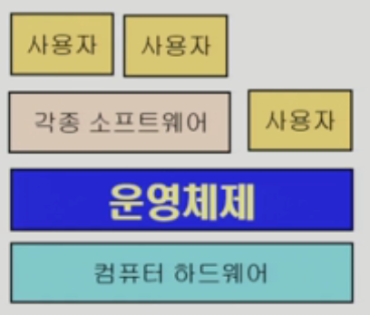
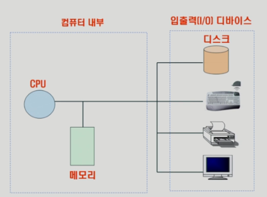
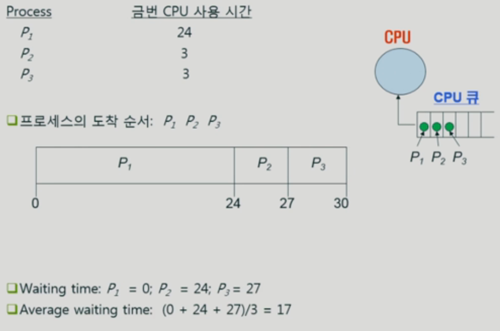
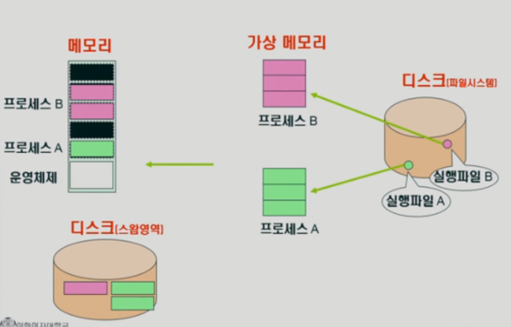
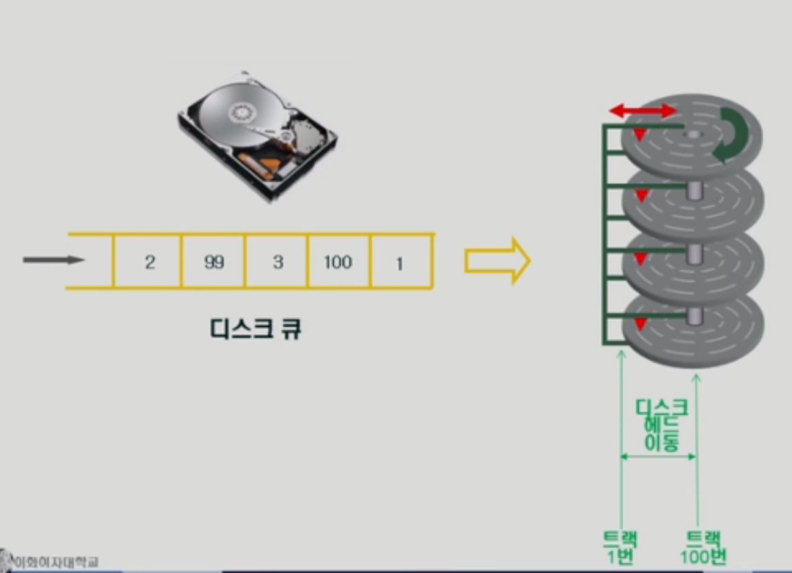
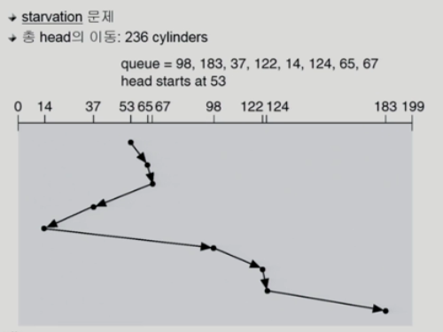

## 목차

- [1. 운영체제란?](#1-운영체제란)
- [2. 운영체제의 목적](#2-운영체제의-목적)
- [3. 운영체제의 기능](#3-운영체제의-기능)
    - [3-1. CPU 스케줄링](#3-1-cpu-스케줄링)
    - [3-2. 메모리 관리](#3-2-메모리-관리)
    - [3-3. 디스크 스케줄링](#3-3-디스크-스케줄링)
    - [3-4. 저장장치 계층구조와 캐싱](#3-4-저장장치-계층구조와-캐싱)
- [4. 운영체제의 분류](#4-운영체제의-분류)
- [5. 몇 가지 용어](#5-몇-가지-용어)
- [6. 운영체제의 종류](#6-운영체제의-종류)
- [7. 운영체제의 예](#7-운영체제의-예)

# 1. [운영체제란?](#목차)
- 컴퓨터 하드웨어 바로 위에 설치되어 사용자 및 다른 모든 소프트웨어와 하드웨어를 연결하는 소프트웨어 계층<br>
        <figure>
        
        </figure>
  - 사용자가 하드웨어에 대한 지식이 부족하더라도 편리하게 사용할 수 있도록 도와주는 역할을 한다.
- 좁은 의미의 운영체제(커널) : 운영체제의 핵심 부분으로, 메모리에 상주하는 부분
- 넓은 의미의 운영체제 : 커널 + 주변 시스템 유틸리티
 
<br><br>

# 2. [운영체제의 목적](#목차)
1. 컴퓨터 시스템을 **편리하게 사용할 수 있는 환경을 제공**
    - 컴퓨터 한대를 여러명의 사용자(or 프로그램)가 사용해도 불편함이 없도록 함
2. 컴퓨터 시스템의 **자원을 효율적으로 관리** (중요!)
    - 하드웨어 및 소프트웨어 자원을 관리하며, 컴퓨터의 두뇌(혹은 통치자) 역할을 한다.
    - 자원 : CPU, 메모리, I/O 장치
    - 고려사항 : 효율성, 형평성<br><br>

# 3. [운영체제의 기능](#목차)
- 컴퓨터 시스템의 기본 구조<br>
        <figure>
        
        </figure>
    - 구성 : CPU, 메모리, I/O 장치(디스크, 키보드, 마우스, 모니터 등)
1. CPU 스케줄링 : 각 프로그램에게 CPU 사용권한 부여 순서 결정
2. 메모리 관리 : 한정된 메모리의 할당을 결정
3. 디스크 스케줄링 : 디스크에서 들어온 요청의 처리순서 결정
    - CPU와 다르게 물리적인 헤드가 있기 때문에 스케줄링 방식이 다름
4. 인터럽트, 캐싱 : CPU와 I/O 장치 사이의 속도 차이를 극복하기 위한 기능<br><br>
- I/O 스캐줄링<br>
        <figure>
        
        </figure>
    - 입출력 큐에 순서대로 작업을 수행 (I/O 장비에서도 필요할 때 큐에 추가)
    - 사람과 상호작용하는 프로그램 / I/O 작업 없이 CPU를 오래 사용하는 프로그램으로 나눌 수 있음

### 3-1. [CPU 스케줄링](#목차)
1. FCFS(First-Come-First-Served)<br>
        <figure>
        
        </figure>
    - 먼저 요청한 프로그램 먼저 처리
    - 앞선 프로세스가 CPU 사용시간이 길다면 평균 대기시간이 늘어난다.
    - 공평할순 있으나, 효율적이진 않음
2. SJF(Shorted-Job-First)<br>
        <figure>
        
        </figure>
    - 평균 대기시간이 가장 짧은 방법
    - 그러나 CPU를 할당받지 못하는 기아현상이 일어날 수 있음
    - 효율적일순 있으나, 형평성이 어긋남
3. RR(Round-Robin)<br>
        <figure>
        
        </figure>
    - 프로세스가 한번에 CPU를 사용할 수 있는 시간이 정해져있는 방식
    - 사용시간이 실수록 프로세스는 기다리는 시간이 길어지게 된다.
    - 현재 가장 많이 사용되는 방식

### 3-2. [메모리 관리](#목차)
- 디스크의 **파일시스템**에서 각 실행파일이 메모리에 올라가서 프로세스가 된다.
- 이 때, **가상 메모리**를 형성하는 단계를 거쳐 올라가게 된다.<br>
        <figure>
        
        </figure>
    - 메모리는 가상메모리에서 당장 필요한 부분만 가져와서 올려놓게 된다.
    - 이 때, 메모리가 다 차게되면 안되기 때문에 사용하지 않는 메모리는 디스크의 **스왑영역**에 저장된다.
        - 전원이 꺼질 경우, 파일시스템은 기존과 같은 역할이지만, 스왑영역은 데이터는 남아있으나 의미가 없는 데이터가 된다.<br><br>
- LRU vs. LFU<br>
        <figure>
        
        </figure>
    1. LRU (가장 오래 전에 참조한 페이지 삭제) : 1번 삭제
    2. LFU (참조 횟수가 가장 적은 페이지 삭제) : 4번 삭제
        - 최근에는 둘을 보완한 방법도 연구되고 있다.

### 3-3. [디스크 스케줄링](#목차)
- 디스크의 구조와 디스크 큐<br>
        <figure>
        
        </figure>
    - 디스크에서 데이터를 읽을 때 가장 시간이 오래걸리는 부분은 헤드의 이동이다.
    - 따라서 헤드의 이동시간을 최소화 하는 방법이 필요하다.<br>
        <figure>
        
        </figure>
    - 디스크 접근시간 구성요소 : 탐색시간(중요!), 회전지연, 전송시간
        - 탐색시간을 최소화하기 위해서는 탐색거리를 줄이는게 중요하다!
- FCFS(First-Come-First-Served)<br>
        <figure>
        
        </figure>
    - 헤드의 이동거리 효율이 너무 낮음
- SSTF(Shortest-Seek-Time-First)<br>
        <figure>
        
        </figure>
    - 헤드의 이동거리 효율은 좋으나, 기아현상이 발생할 수 있음
- SCAN<br>
        <figure>
        
        </figure>
    - 헤드는 요청과 상관없이 일정한 스캔을 진행함

### 3-4. [저장장치 계층구조와 캐싱](#목차)
- 저장장치 계층구조<br>
        <figure>
        
        </figure>
    - CPU 내부에 아주 작은 메모리인 레지스터
    - 메인 메모리와 레지스터 차이의 속도 차이를 극복하기 위해 캐시메모리를 둔다.
    - 메인메모리 아래는 하드디스크와 같은 디스크가 존재함
        ```
        Primary     Secondary
        고속        저속
        고가        저가
        휘발성      비휘발성
        Read(사용)  Write(저장)
        ```
    - 캐싱은 중간에 저장할 곳을 두어 재사용성을 높인 기술을 말한다.<br><br>
- 플래시메모리<br>
        <figure>
        
        </figure>
    - 단점 : 쓰기 횟수 제한, 데이터 변질 등 하드웨어적 약점 (소프트웨어적으로 보완중)
    - 장점 : 속도, 휴대성, 견고함<br><br>
 
# 4. [운영체제의 분류](#목차)
- 동시작업 가능 여부에 따른 분류
    1. 단일작업
        - 한번에 하나의 작업만 처리한다.
        - ex : MS-DOS
    2. 다중작업
        - 동시에 두 개 이상의 작업을 처리한다.
        - ex : UNIX, MS Window 등
        - 여러 작업을 수행함에 있어서 형평성과 효율성을 고려해야 한다.<br><br>
- 사용자의 수에 따른 분류
    1. 단일 사용자
        - 한번에 하나의 사용자만 접속 가능
        - ex : MS-DOS, MS Windows
    2. 다중 사용자
        - 동시에 여러 사용자가 이용 가능
        - ex : UNIX, NT server
        - 단일 사용자에 비해 보안이 중요해짐<br><br>
- 처리방식에 따른 분류
    1. 일괄처리(batch)
        - 작업 요청을 일정량 모아서 한번에 처리
        - 작업이 완전 종료될 때까지 기다려야 한다.
        - 초기 시스템 구조
    2. 시분해
        - 여러 작업을 수행할 때 컴퓨터 처리 능력을 일정한 시간단위로 분할하여 사용
        - 짧은 응답 시간(interactive)
        - ex : UNIX
    3. 실시간
        - 정해진 시간에 반드시 어떠한 일이 종료됨이 보장되어야 하는 시스템을 위한 OS
        - deadline이 존재하는 시스템
        - Hard realtime system : 미사일, 원자로 등 매우 중요한 시스템에 적용
        - Soft realtime system : 비디오 스트리밍 등 일반 시스템에서 실시간 서비스가 필요할 때 사용

# 5. [몇 가지 용어](#목차)
```
1. 여러 작업을 동시에 실행한다는 용어
Multi-tasking       : 프로그램 관점
Multi-programing    : 메모리 관점
Time sharing        : CPU 관점
Multi-process       : 프로세스 관점

2. 한 컴퓨터에 여러 CPU를 가짐
Multi-processor
```

# 6. [운영체제의 종류](#목차)
- 서버용, PC용, 스마트디바이스용 운영체제가 나뉜다.
- 공개 소프트웨어 : 리눅스, 안드로이드<br>
    <figure>
    
    </figure>

# 7. [운영체제의 예](#목차)
1. 유닉스(UNIX)
    - 서버를 위한 OS로, 매우 복잡했던 이전의 어셈블리언어를 대체하는 C언어로 이루어져 있다.
    - C언어를 사용하여 사람이 이해하기가 보다 쉬워졌으며, 수정이 용이하고, 높은 이식도를 가지게 되었다.
    - 최소 커널을 가지도록 설계되었기 때문에 효율적이고, 확장이 용이하다.
    - 다양한 종류가 개발되었고, 현재 대표적으로 Linux가 있다.<br><br>
2. DOS(Disk Operating System)
    - IBM-PC라는 특정 컴퓨터를 위해 개발됨
    - 단일 사용자, 단일작업을 위한 운영체제로, 메모리 관리 능력을 크게 고려하지 않음<br><br>
3. MS Windows
    - 다중작업용 OS로, GUI를 기반으로 한다.
    - Linux 등 다른 시스템에 비해 불안정하다.<br><br>
4. 휴대기기를 위한 OS
    - PalmOS, Android 등등